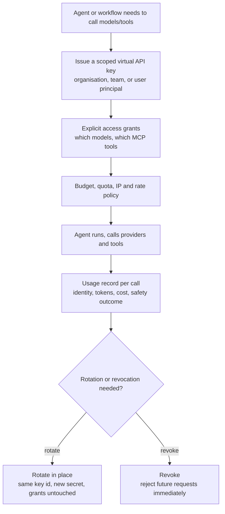
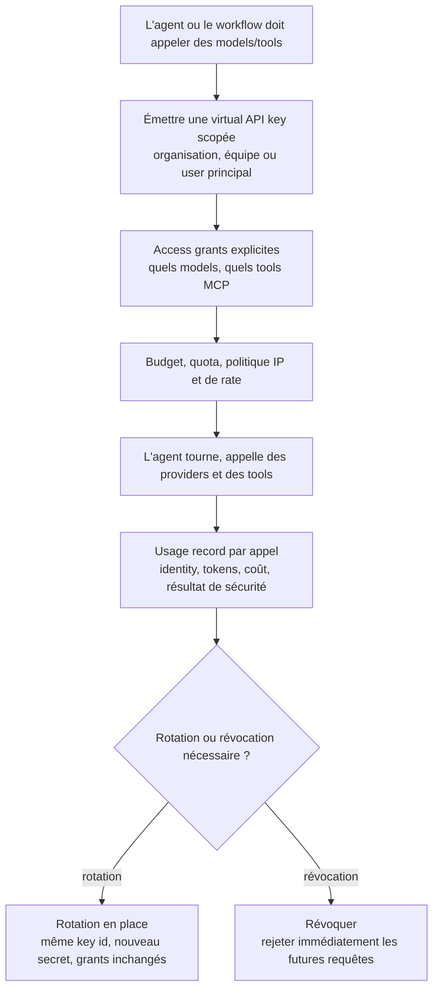

---
{
  "slug": "ai-agent-identity-and-non-human-identity-security-in-2026",
  "category": "AI Security",
  "title": "AI Agents Are Non-Human Identities Now: The 2026 Credential Sprawl Problem",
  "seoTitle": "Non-Human Identity Security for AI Agents in 2026",
  "description": "Non-human identities now outnumber humans 144 to 1 in cloud environments, and most organisations still do not treat AI agents as identities with a lifecycle. Here is why agent credential sprawl became the real agentic AI risk, and how gateway-issued virtual keys close the gap.",
  "excerpt": "Your AI agents are not features. They are non-human identities, they hold credentials, they act autonomously, and most security teams have no lifecycle for them at all. Here is why NHI sprawl became 2026's quiet agentic AI risk, and what fixing it actually requires.",
  "publishedAt": "2026-07-17",
  "updatedAt": "2026-07-17",
  "readingTime": "12 min",
  "keywords": [
    "non-human identity",
    "nhi security",
    "ai agent identity",
    "agentic ai security 2026",
    "credential sprawl",
    "ai agent credentials",
    "machine identity governance"
  ],
  "heroEyebrow": "Agentic AI security",
  "intro": "Security teams spent two decades building identity programs for humans: onboarding, MFA, least privilege, offboarding. AI agents broke that model quietly, because nobody decided to treat an agent as an identity, it just started acquiring credentials, calling APIs, and spawning sub-agents the way service accounts always have, except autonomously and at a pace no static account ever moved at. The 2026 data on non-human identity sprawl says this gap is now the primary risk in agentic AI, ahead of prompt injection, ahead of jailbreaks. Here is what the numbers show and what an actual fix looks like.",
  "keyTakeaways": [
    "Non-human identities outnumber human identities 144 to 1 in cloud-native environments in 2026, up from 92 to 1 two years earlier, and AI agents are the fastest-growing category inside that number.",
    "The gap is not awareness, most teams know agents hold credentials. The gap is lifecycle: over 16% of organisations do not even track creation of AI-related identities, and only about 22% treat agents as independent identities with rotation, scoping, and revocation.",
    "The fix is to stop treating an agent's credential as a static secret and start treating it as a scoped, attributable, revocable identity issued and governed at the gateway, the same discipline already applied to human accounts."
  ],
  "faq": [
    {
      "question": "Isn't an AI agent's API key just a service account?",
      "answer": "It starts that way, but agents behave differently from static service accounts. A service account calls the same API in the same pattern for years. An agent acquires permissions dynamically at runtime, can spawn sub-agents, chains tool calls across many systems, and can be redirected by its own inputs. The credential is the same shape as a service account key, but the blast radius behind it is not, which is why treating it with service-account-era controls is not enough."
    },
    {
      "question": "What does 'treating an agent as an identity' mean in practice?",
      "answer": "It means the agent gets its own scoped credential rather than inheriting a developer's or a shared system's, that credential has explicit access grants to specific models and tools rather than blanket access, it has a budget and a quota, it can be rotated without breaking every integration that depends on it, and every action it takes produces an attributable record."
    },
    {
      "question": "Why did non-human identity overtake prompt injection as the top agentic AI concern in 2026?",
      "answer": "Because prompt injection is a per-request risk with a per-request blast radius, while a poorly governed agent credential is a standing risk that persists across every request the agent ever makes. IBM's data cited in 2026 identity research found 97% of AI-related security breaches involved AI that lacked proper access controls, which points at the credential layer, not the prompt layer, as the recurring root cause."
    }
  ],
  "relatedSlugs": [
    "mcp-security-risks-enterprise-ai-agents-2026",
    "mcp-server-governance-for-ai-agents",
    "shadow-ai-2026-how-to-govern-unsanctioned-ai-tool-use",
    "how-to-build-a-lifecycle-aware-ai-security-engine"
  ],
  "cta": {
    "title": "Give every agent a scoped, revocable identity",
    "description": "Odock issues a virtual API key per agent, team, or workflow, with explicit model and MCP access grants, budgets, and full usage records, so agent credentials stop being static secrets nobody can rotate safely.",
    "primaryLabel": "Request a demo",
    "primaryHref": "#waitlist-section",
    "secondaryLabel": "Explore MCP governance",
    "secondaryHref": "/mcp-gateway/"
  },
  "locales": {
    "fr": {
      "category": "AI Security",
      "title": "Les agents IA sont désormais des non-human identities : le problème de credential sprawl de 2026",
      "seoTitle": "Sécurité des non-human identities pour les agents IA en 2026",
      "description": "Les non-human identities dépassent désormais les humains dans un ratio de 144 pour 1 dans les environnements cloud, et la plupart des organisations ne traitent toujours pas les agents IA comme des identities dotées d'un lifecycle. Voici pourquoi la multiplication des credentials d'agents est devenue le véritable risque agentic AI, et comment les virtual keys émises par la gateway comblent cet écart.",
      "excerpt": "Vos agents IA ne sont pas de simples features. Ce sont des non-human identities : ils détiennent des credentials, agissent de façon autonome, et la plupart des équipes de sécurité n'ont aucun lifecycle prévu pour eux. Voici pourquoi la multiplication des NHI est devenue le risque agentic AI silencieux de 2026, et ce qu'il faut réellement faire pour y remédier.",
      "heroEyebrow": "Sécurité agentic AI",
      "intro": "Les équipes de sécurité ont passé deux décennies à construire des programmes d'identity pour les humains : onboarding, MFA, moindre privilège, offboarding. Les agents IA ont discrètement fait voler ce modèle en éclats, car personne n'a décidé de traiter un agent comme une identity : il s'est simplement mis à acquérir des credentials, à appeler des APIs et à faire naître des sous-agents, comme l'ont toujours fait les service accounts, sauf de façon autonome et à un rythme qu'aucun compte statique n'a jamais atteint. Les données 2026 sur la multiplication des non-human identities indiquent que cet écart est désormais le risque principal de l'agentic AI, devant le prompt injection, devant les jailbreaks. Voici ce que montrent les chiffres, et à quoi ressemble une véritable solution.",
      "keyTakeaways": [
        "Les non-human identities dépassent les identities humaines dans un ratio de 144 pour 1 dans les environnements cloud-native en 2026, contre 92 pour 1 deux ans plus tôt, et les agents IA sont la catégorie qui croît le plus vite au sein de ce chiffre.",
        "L'écart n'est pas un problème de conscience du risque, la plupart des équipes savent que les agents détiennent des credentials. L'écart, c'est le lifecycle : plus de 16 % des organisations ne suivent même pas la création des identities liées à l'IA, et seules environ 22 % traitent les agents comme des identities indépendantes, avec rotation, scoping et révocation.",
        "La solution consiste à cesser de traiter le credential d'un agent comme un secret statique, et à le traiter comme une identity scopée, attribuable et révocable, émise et gouvernée au niveau de la gateway, la même discipline déjà appliquée aux comptes humains."
      ],
      "cta": {
        "title": "Donnez à chaque agent une identity scopée et révocable",
        "description": "Odock émet une virtual API key par agent, équipe ou workflow, avec des access grants explicites sur les models et le MCP, des budgets et des usage records complets, afin que les credentials d'agents cessent d'être des secrets statiques que personne ne peut faire tourner en toute sécurité.",
        "primaryLabel": "Demander une démo",
        "secondaryLabel": "Explorer la gouvernance MCP"
      },
      "readingTime": "12 min",
      "keywords": [
        "non-human identity",
        "sécurité nhi",
        "identity des agents ia",
        "sécurité agentic ai 2026",
        "multiplication des credentials",
        "credentials des agents ia",
        "gouvernance des identities machines"
      ],
      "faq": [
        {
          "question": "La clé API d'un agent IA n'est-elle pas simplement un service account ?",
          "answer": "Cela commence ainsi, mais les agents se comportent différemment des service accounts statiques. Un service account appelle la même API selon le même pattern pendant des années. Un agent acquiert des permissions de façon dynamique au runtime, peut faire naître des sous-agents, enchaîne des tool calls à travers de nombreux systèmes, et peut être redirigé par ses propres inputs. Le credential a la même forme qu'une clé de service account, mais le blast radius qui se cache derrière ne l'est pas, ce qui explique pourquoi les contrôles hérités de l'ère des service accounts ne suffisent pas."
        },
        {
          "question": "Que signifie « traiter un agent comme une identity » en pratique ?",
          "answer": "Cela signifie que l'agent reçoit son propre credential scopé plutôt que d'hériter de celui d'un développeur ou d'un système partagé, que ce credential dispose d'access grants explicites vers des models et des tools précis plutôt qu'un accès global, qu'il a un budget et un quota, qu'il peut faire l'objet d'une rotation sans casser chaque intégration qui en dépend, et que chacune de ses actions produit un enregistrement attribuable."
        },
        {
          "question": "Pourquoi le non-human identity a-t-il dépassé le prompt injection comme première préoccupation agentic AI en 2026 ?",
          "answer": "Parce que le prompt injection est un risque par requête, avec un blast radius limité à cette requête, alors qu'un credential d'agent mal gouverné est un risque permanent qui persiste sur chaque requête que l'agent effectue jamais. Les données d'IBM citées dans les recherches 2026 sur l'identity montrent que 97 % des breaches de sécurité liées à l'IA impliquaient une IA dépourvue de contrôles d'accès appropriés, ce qui désigne la couche du credential, et non celle du prompt, comme cause racine récurrente."
        }
      ]
    }
  }
}
---
<!-- locale:en -->
## The ratio that should worry you more than the prompt injection headline

Most of the 2026 conversation about agentic AI risk still centres on what a malicious prompt can trick an agent into doing. That is a real risk, and we have written about it in [our MCP security risks piece](/blog/mcp-security-risks-enterprise-ai-agents-2026/). But a quieter number from this year's identity research points at something structurally bigger: non-human identities now outnumber human identities 144 to 1 in cloud-native environments, up from 92 to 1 just two years earlier, a 56% jump in the ratio in a single year, according to 2026 research aggregated by the Cloud Security Alliance and reported across the non-human identity security community. In a typical enterprise, bots, service accounts, and AI agents now outnumber human users roughly 100 to 1.

AI agents are the fastest-growing slice of that population, and they are also the least well governed slice of it. That combination, growth plus governance gap, is exactly the shape of every credential-driven breach the security industry has seen before, just compressed into a shorter timeline because agents provision and act faster than any human onboarding process ever did.

## Why an agent's credential is not just another service account key

It is tempting to file "AI agent identity" under the same bucket as "service account management," a problem security teams have handled for years. The shape of the credential is similar, a key or token that authenticates a non-human caller, but the behaviour behind it is not.

A traditional service account calls the same handful of APIs in the same pattern, day after day, for years. Its blast radius is knowable because its behaviour is static. An AI agent is the opposite of static: it acquires permissions dynamically at runtime, can spawn sub-agents to delegate parts of a task, invokes external APIs and tools it was not explicitly told to call in advance, writes and executes code, and chains actions across many systems in a single session. Each of those behaviours expands what a single compromised or over-scoped credential can reach, well past what a static service account could ever have done with the same nominal permissions.

The 2026 governance data reflects exactly this gap. A Cloud Security Alliance analysis of token sprawl found more than 16% of organisations do not track the creation of AI-related identities at all, meaning an agent can come into existence, hold a credential, and act, with no inventory entry anywhere. Nearly a quarter of organisations take more than 24 hours to rotate or revoke a credential after it is potentially exposed, and 30% take over a day just to triage a high-severity leak. Meanwhile most organisations report agents are already running in production, across public cloud, on-premises, and hybrid environments. Production usage arrived before the lifecycle discipline did.

## What "treating agents as identities" actually requires

The instinct in a lot of organisations is to give an agent a developer's personal token, or a shared service credential everyone already has lying around, because it is faster to ship. That shortcut is precisely what the 22% figure above describes: only about one in five organisations currently treats agents as independent identities with their own lifecycle. Doing it properly means four things, none of them exotic, all of them frequently skipped under deadline pressure.

**Issue a scoped credential per agent, not a shared one.** Odock's [virtual API keys](https://docs.odock.ai/docs/management/virtual-api-keys/) can be scoped to an organisation, team, or user principal, so an agent's traffic is attributable to a specific chain rather than to "whichever developer's key was handy." See [scope and principals](https://docs.odock.ai/docs/management/virtual-api-keys/scope-and-principals/) for how that chain is built.

**Grant access explicitly, per model and per tool.** An agent should not inherit blanket access because it is convenient. Model and MCP access grants exist precisely so an agent's reach is the intersection of what it needs, not the union of everything the organisation has ever connected. [MCP security](https://docs.odock.ai/docs/models-and-mcp/mcp-servers/security/) covers tool-level allow and block lists for exactly this reason.

**Rotate without breaking everything downstream.** The reason rotation lags for days in the wild is usually that rotating a credential means re-wiring every integration that depends on it. Odock's [key lifecycle and rotation](https://docs.odock.ai/docs/management/virtual-api-keys/lifecycle-and-rotation/) rotates in place, the key id stays constant, model access, budgets, quotas, and usage attribution stay attached, and only the secret changes. That is what turns "rotation should happen within an hour" from an aspiration into something operationally realistic.

**Make every action attributable after the fact.** A revoked or rotated credential answers "what can this agent do now." A [usage record](https://docs.odock.ai/docs/observability/usage-records/) answers "what did this agent already do," which is the question that actually matters during an incident review.

## The coming complication: agent-to-agent traffic

The identity problem gets harder as agents start talking to other agents rather than only to tools. Protocols like Agent2Agent, stewarded by the Linux Foundation since Google introduced it in 2025, let agents advertise capabilities and negotiate tasks through a machine-readable AgentCard that can declare supported auth schemes such as OAuth 2.0, OpenID Connect, API keys, or mutual TLS. That is a real step forward for interoperability, and it is explicit about what it does not solve: the protocol does not provision credentials or decide authorization for you. Researchers analysing A2A's threat surface point at fake agent advertisement, unauthorized registration, and recursive delegation loops as protocol-specific risks precisely because identity and authorization are left to whoever operates the deployment.

That gap is exactly the reason identity cannot be an afterthought bolted onto agent frameworks. Whatever protocol your agents speak to each other, something still has to answer "which credential is this, what is it allowed to touch, and can I revoke it in seconds," and that answer has to live at the layer every request actually passes through, not in each framework's own auth code.

## The honest limits here

Gateway-issued identity fixes the part of the problem that is infrastructural: scoping, rotation, revocation, and attribution. It does not fix an agent being tricked by a malicious input into misusing the access it legitimately holds, that is a prompt- and content-level problem, covered by tools like Odock's SafetySec engine rather than by identity management alone. The two layers are complementary, not substitutes. An agent with a tightly scoped, rotatable identity and no content inspection can still be manipulated into misusing what it is allowed to touch. An agent with excellent content inspection but a shared, unscoped, unrotatable credential is one leaked secret away from an unbounded blast radius. You need both, and most 2026 breach data suggests organisations currently have neither in a mature state.

## Where Odock.ai comes in

I built Odock's virtual API key system with exactly this gap in mind, so read the following as an interested party's take. Every application, team, user, and agent that calls through Odock gets its own scoped virtual key, with explicit model and MCP access grants, budgets, quotas, and in-place rotation, plus a usage record on every single call. That means an agent is never a shared secret pretending to be an identity, it is an actual identity with a real lifecycle, from issuance to revocation.

If your organisation already has agents in production and is part of the roughly 78% still treating them as static credentials rather than governed identities, the fix is not a bigger spreadsheet of who has which key. It is putting agent traffic behind a gateway that was built to issue, scope, rotate, and revoke identities as a first-class operation. [Request a demo](#waitlist-section) or start with [MCP governance at Odock](/mcp-gateway/) and give your agents an identity lifecycle before an incident forces you to build one under pressure.

## Sources

- [The Non-Human Identity Governance Vacuum, Cloud Security Alliance](https://labs.cloudsecurityalliance.org/research/csa-whitepaper-nonhuman-identity-agentic-ai-governance-v1-cs/)
- [Token Sprawl in the Age of AI, Cloud Security Alliance](https://cloudsecurityalliance.org/blog/2026/02/18/token-sprawl-in-the-age-of-ai)
- [The 2026 Data Breach Investigations Report Confirms It: Identity Is the Control Plane for Agentic AI, Token Security](https://www.token.security/blog/the-2026-data-breach-investigations-report-confirms-it-identity-is-the-control-plane-for-agentic-ai)
- [Non-human identity sprawl is agentic AI's real risk, InformationWeek](https://www.informationweek.com/risk-management/non-human-identity-sprawl-is-agentic-ai-s-real-risk)
- [Odock virtual API keys](https://docs.odock.ai/docs/management/virtual-api-keys/)
- [Odock MCP security](https://docs.odock.ai/docs/models-and-mcp/mcp-servers/security/)

<!-- locale:fr -->
## Le ratio qui devrait vous inquiéter plus que les titres sur le prompt injection

La majeure partie des discussions de 2026 sur le risque agentic AI se concentre encore sur ce qu'un prompt malveillant peut pousser un agent à faire. C'est un risque réel, et nous en avons parlé dans [notre article sur les risques de sécurité MCP](/fr/blog/mcp-security-risks-enterprise-ai-agents-2026/). Mais un chiffre plus discret, issu des recherches de cette année sur l'identity, pointe vers quelque chose de structurellement plus important : les non-human identities dépassent désormais les identities humaines dans un ratio de 144 pour 1 dans les environnements cloud-native, contre 92 pour 1 deux ans plus tôt seulement, soit un bond de 56 % du ratio en une seule année, selon des recherches 2026 compilées par la Cloud Security Alliance et relayées dans toute la communauté de la sécurité des non-human identities. Dans une entreprise type, les bots, les service accounts et les agents IA dépassent désormais les utilisateurs humains dans un ratio d'environ 100 pour 1.

Les agents IA constituent la part de cette population qui croît le plus vite, et c'est aussi la moins bien gouvernée. Cette combinaison, croissance plus déficit de gouvernance, correspond exactement à la forme de toutes les breaches liées aux credentials que le secteur de la sécurité a déjà connues, simplement comprimée sur un délai plus court, parce que les agents se provisionnent et agissent plus vite qu'aucun processus d'onboarding humain ne l'a jamais fait.

## Pourquoi le credential d'un agent n'est pas une clé de service account comme les autres

Il est tentant de ranger « l'identity de l'agent IA » dans la même catégorie que « la gestion des service accounts », un problème que les équipes de sécurité traitent depuis des années. La forme du credential est similaire, une clé ou un token qui authentifie un appelant non-human, mais le comportement qui se cache derrière ne l'est pas.

Un service account traditionnel appelle toujours la même poignée d'APIs selon le même pattern, jour après jour, pendant des années. Son blast radius est connu à l'avance car son comportement est statique. Un agent IA, à l'inverse, n'a rien de statique : il acquiert des permissions de façon dynamique au runtime, peut faire naître des sous-agents pour déléguer une partie d'une tâche, invoque des APIs et des outils externes qu'on ne lui a pas explicitement demandé d'appeler à l'avance, écrit et exécute du code, et enchaîne des actions à travers de nombreux systèmes au sein d'une même session. Chacun de ces comportements élargit ce qu'un seul credential compromis ou trop largement scopé peut atteindre, bien au-delà de ce qu'un service account statique aurait jamais pu faire avec les mêmes permissions nominales.

Les données de gouvernance 2026 reflètent exactement cet écart. Une analyse de la Cloud Security Alliance sur le token sprawl révèle que plus de 16 % des organisations ne suivent absolument pas la création des identities liées à l'IA, ce qui signifie qu'un agent peut naître, détenir un credential et agir sans qu'aucune entrée d'inventaire n'existe nulle part. Près d'un quart des organisations mettent plus de 24 heures à faire la rotation ou à révoquer un credential potentiellement exposé, et 30 % mettent plus d'une journée entière rien que pour trier une fuite de sévérité critique. Dans le même temps, la plupart des organisations indiquent que des agents tournent déjà en production, sur du cloud public, on-premises et en environnement hybride. L'usage en production est arrivé avant la discipline de lifecycle.

## Ce qu'implique réellement le fait de traiter les agents comme des identities

Dans beaucoup d'organisations, le réflexe est de donner à un agent le token personnel d'un développeur, ou un credential de service partagé que tout le monde a déjà sous la main, parce que c'est plus rapide à shipper. Ce raccourci est précisément ce que décrit le chiffre de 22 % évoqué plus haut : seule environ une organisation sur cinq traite aujourd'hui les agents comme des identities indépendantes dotées de leur propre lifecycle. Bien le faire suppose quatre choses, aucune exotique, mais toutes fréquemment sacrifiées sous la pression des délais.

**Émettre un credential scopé par agent, jamais un credential partagé.** Les [virtual API keys](https://docs.odock.ai/docs/management/virtual-api-keys/) d'Odock peuvent être scopées à une organisation, une équipe ou un user principal, de sorte que le trafic d'un agent soit attribuable à une chaîne précise plutôt qu'à « la clé du développeur qui était sous la main ». Voir [scope et principals](https://docs.odock.ai/docs/management/virtual-api-keys/scope-and-principals/) pour comprendre comment cette chaîne est construite.

**Accorder l'accès explicitement, model par model et tool par tool.** Un agent ne devrait pas hériter d'un accès global simplement parce que c'est pratique. Les access grants sur les models et le MCP existent précisément pour que la portée d'un agent corresponde à l'intersection de ce dont il a besoin, et non à l'union de tout ce que l'organisation a jamais connecté. [La sécurité MCP](https://docs.odock.ai/docs/models-and-mcp/mcp-servers/security/) couvre les allow lists et block lists au niveau des tools, précisément pour cette raison.

**Faire la rotation sans casser toute la chaîne en aval.** Si la rotation prend souvent des jours dans la pratique, c'est généralement parce que faire tourner un credential oblige à rebrancher chaque intégration qui en dépend. Le [lifecycle et la rotation des clés](https://docs.odock.ai/docs/management/virtual-api-keys/lifecycle-and-rotation/) d'Odock effectuent la rotation en place : le key id reste constant, l'accès aux models, les budgets, les quotas et l'attribution d'usage restent rattachés, seul le secret change. C'est ce qui transforme « la rotation devrait se faire en moins d'une heure » d'une aspiration en une réalité opérationnelle.

**Rendre chaque action attribuable a posteriori.** Un credential révoqué ou ayant subi une rotation répond à la question « que peut faire cet agent maintenant ? ». Un [usage record](https://docs.odock.ai/docs/observability/usage-records/) répond à « qu'est-ce que cet agent a déjà fait ? », la question qui compte vraiment lors d'une revue d'incident.

## La prochaine complication : le trafic agent-to-agent

Le problème d'identity se complique à mesure que les agents commencent à parler à d'autres agents, et non plus seulement à des tools. Des protocoles comme Agent2Agent, sous la responsabilité de la Linux Foundation depuis que Google l'a introduit en 2025, permettent aux agents d'annoncer leurs capacités et de négocier des tâches via un AgentCard lisible par machine, qui peut déclarer les schémas d'authentification supportés tels qu'OAuth 2.0, OpenID Connect, API keys ou mutual TLS. C'est une réelle avancée pour l'interopérabilité, et le protocole est explicite sur ce qu'il ne résout pas : il ne provisionne pas les credentials et ne décide pas de l'autorisation à votre place. Les chercheurs qui analysent la surface d'attaque d'A2A pointent la fausse annonce d'agents, l'enregistrement non autorisé et les boucles de délégation récursive comme des risques propres au protocole, précisément parce que l'identity et l'autorisation sont laissées à la charge de qui opère le déploiement.

C'est exactement cet écart qui explique pourquoi l'identity ne peut pas être une réflexion après coup, greffée sur des frameworks d'agents. Quel que soit le protocole que vos agents utilisent pour se parler, il faut toujours répondre à la question « de quel credential s'agit-il, à quoi a-t-il le droit de toucher, et puis-je le révoquer en quelques secondes », et cette réponse doit vivre au niveau de la couche que chaque requête traverse réellement, pas dans le code d'authentification propre à chaque framework.

## Les limites à connaître

Une identity émise par la gateway règle la partie infrastructurelle du problème : le scoping, la rotation, la révocation et l'attribution. Elle ne règle pas le cas d'un agent trompé par une entrée malveillante et amené à détourner l'accès qu'il détient légitimement ; c'est un problème qui se situe au niveau du prompt et du contenu, couvert par des outils comme le moteur SafetySec d'Odock, et non par la seule gestion des identities. Les deux couches sont complémentaires, pas substituables. Un agent doté d'une identity étroitement scopée et rotatable, mais sans inspection de contenu, peut toujours être manipulé pour détourner ce qu'il est autorisé à toucher. Un agent doté d'une excellente inspection de contenu, mais d'un credential partagé, non scopé et non rotatable, n'est qu'à un secret divulgué d'un blast radius illimité. Il faut les deux, et la plupart des données 2026 sur les breaches suggèrent que la majorité des organisations n'ont aujourd'hui ni l'un ni l'autre à un niveau mature.

## Là où Odock.ai intervient

J'ai conçu le système de virtual API keys d'Odock en ayant précisément cet écart en tête, donc lisez ce qui suit comme le point de vue d'une partie prenante non neutre. Chaque application, équipe, utilisateur et agent qui passe par Odock reçoit sa propre virtual key scopée, avec des access grants explicites sur les models et le MCP, des budgets, des quotas et une rotation en place, ainsi qu'un usage record sur chaque appel. Cela signifie qu'un agent n'est jamais un secret partagé se faisant passer pour une identity : c'est une véritable identity, dotée d'un vrai lifecycle, de l'émission jusqu'à la révocation.

Si votre organisation a déjà des agents en production et fait partie des quelque 78 % qui les traitent encore comme des credentials statiques plutôt que comme des identities gouvernées, la solution n'est pas un tableur plus volumineux recensant qui détient quelle clé. C'est de placer le trafic de vos agents derrière une gateway conçue pour émettre, scoper, faire tourner et révoquer des identities comme une opération de premier ordre. [Demandez une démo](#waitlist-section) ou commencez par la [gouvernance MCP chez Odock](/fr/mcp-gateway/) et donnez à vos agents un lifecycle d'identity avant qu'un incident ne vous force à en construire un sous pression.

## Sources

- [The Non-Human Identity Governance Vacuum, Cloud Security Alliance](https://labs.cloudsecurityalliance.org/research/csa-whitepaper-nonhuman-identity-agentic-ai-governance-v1-cs/)
- [Token Sprawl in the Age of AI, Cloud Security Alliance](https://cloudsecurityalliance.org/blog/2026/02/18/token-sprawl-in-the-age-of-ai)
- [The 2026 Data Breach Investigations Report Confirms It: Identity Is the Control Plane for Agentic AI, Token Security](https://www.token.security/blog/the-2026-data-breach-investigations-report-confirms-it-identity-is-the-control-plane-for-agentic-ai)
- [Non-human identity sprawl is agentic AI's real risk, InformationWeek](https://www.informationweek.com/risk-management/non-human-identity-sprawl-is-agentic-ai-s-real-risk)
- [Clés API virtuelles Odock](https://docs.odock.ai/docs/management/virtual-api-keys/)
- [Sécurité MCP Odock](https://docs.odock.ai/docs/models-and-mcp/mcp-servers/security/)
