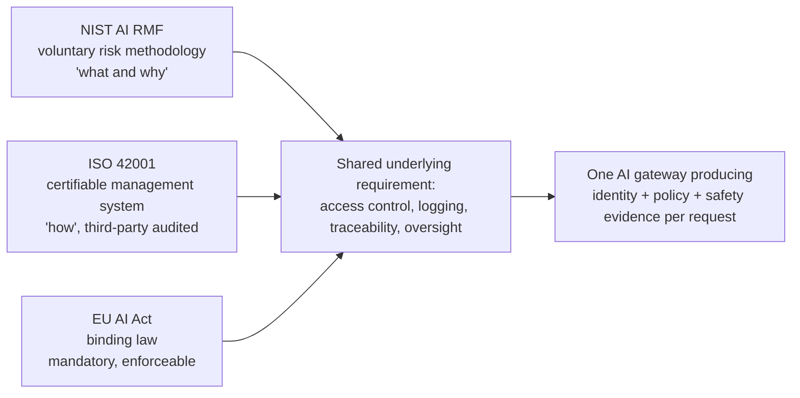
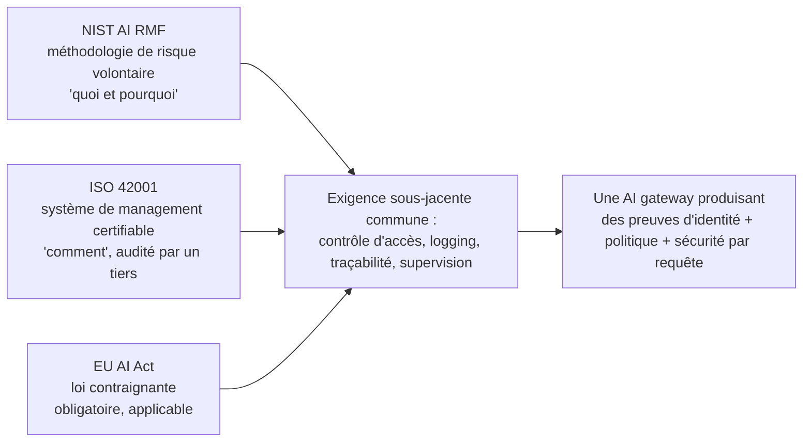

---
{
  "slug": "iso-42001-vs-nist-ai-rmf-vs-eu-ai-act-ai-governance-frameworks-compared",
  "category": "AI Governance",
  "title": "ISO 42001 vs NIST AI RMF vs EU AI Act: One Gateway, Three Frameworks",
  "seoTitle": "ISO 42001 vs NIST AI RMF vs EU AI Act Compared (2026)",
  "description": "Most enterprises in 2026 are being asked for ISO 42001 certification, NIST AI RMF alignment, and EU AI Act evidence at the same time, from different buyers, auditors, and regulators. Here is what each framework actually asks for, where they overlap, and how one gateway produces evidence for all three at once.",
  "excerpt": "ISO 42001, NIST AI RMF, and the EU AI Act are not competing standards, they are three different audiences asking overlapping questions. Procurement wants the certificate, US enterprise wants the risk methodology, the EU wants the legal evidence. Here is how to satisfy all three without building three separate programs.",
  "publishedAt": "2026-07-17",
  "updatedAt": "2026-07-17",
  "readingTime": "11 min",
  "keywords": [
    "iso 42001",
    "nist ai rmf",
    "ai governance frameworks",
    "ai governance framework comparison",
    "iso 42001 certification",
    "ai management system",
    "ai compliance evidence"
  ],
  "heroEyebrow": "AI governance",
  "intro": "Ask three different stakeholders what AI governance means and you will get three different frameworks back. Procurement teams increasingly ask vendors for ISO 42001 certification before they will sign. US enterprise risk teams reach for the NIST AI RMF because it is the vocabulary their existing risk programs already speak. Regulators in the EU do not ask for either, they ask for the specific evidence the AI Act requires by law. Treating these as three separate compliance projects is how governance programs die under their own weight. Treating them as three lenses on the same underlying infrastructure question is how they get built once.",
  "keyTakeaways": [
    "The three frameworks answer different questions for different audiences: NIST AI RMF is a voluntary risk methodology (the 'what' and 'why'), ISO 42001 is a certifiable management system (the 'how', third-party audited), and the EU AI Act is a binding legal obligation with real enforcement dates.",
    "ISO 42001 certification is moving from differentiator to procurement table stakes in 2026, especially in financial services, healthcare, and the public sector, which means it is now a sales-cycle issue, not just a compliance one.",
    "All three frameworks converge on the same underlying infrastructure requirement: access control, logging, traceability, and demonstrable oversight of AI systems, which is exactly what a governed AI gateway produces as a byproduct of normal operation."
  ],
  "faq": [
    {
      "question": "Do we need all three frameworks, or can we pick one?",
      "answer": "Most enterprises in 2026 end up needing more than one because the frameworks serve different audiences, not because any single one is incomplete. A NIST AI RMF program does not satisfy a customer procurement team asking for ISO 42001 certification, and an ISO 42001 certificate does not satisfy an EU regulator asking for AI Act conformity evidence. The common baseline for US companies with European operations is NIST AI RMF plus EU AI Act compliance, often with ISO 42001 layered on top for sales reasons."
    },
    {
      "question": "Is ISO 42001 certification actually required by law anywhere?",
      "answer": "No. Unlike the EU AI Act, ISO 42001 is a voluntary, certifiable management-system standard, similar in spirit to ISO 27001 for information security. Nobody is legally required to get it. The reason it matters commercially is that enterprise buyers in regulated sectors increasingly require it as a condition of vendor qualification, which makes it a practical requirement even without a legal mandate."
    },
    {
      "question": "What is the fastest way to get evidence for all three at once without building three separate programs?",
      "answer": "Centralise the AI traffic these frameworks all care about, model calls, tool and agent actions, access decisions, through one control point that logs identity, policy outcome, and safety outcome on every request. That log is simultaneously NIST AI RMF risk-tracking evidence, ISO 42001 operational-control evidence for an audit, and EU AI Act traceability evidence, because all three frameworks are ultimately asking for the same underlying property: can you show what your AI systems did and who was accountable for it."
    }
  ],
  "relatedSlugs": [
    "eu-ai-act-2026-what-the-august-deadline-means-for-ai-teams",
    "why-the-ai-gateway-became-mandatory-infrastructure-in-2026",
    "how-to-build-a-lifecycle-aware-ai-security-engine",
    "what-to-log-monitor-and-trace-in-production-llm-apps"
  ],
  "cta": {
    "title": "Turn every AI request into evidence for every framework",
    "description": "Odock produces one durable, queryable usage record per request, with identity, policy outcome, and safety outcome attached, so the same infrastructure serves your NIST AI RMF risk register, your ISO 42001 audit, and your EU AI Act documentation.",
    "primaryLabel": "Request a demo",
    "primaryHref": "#waitlist-section",
    "secondaryLabel": "See security and guardrails",
    "secondaryHref": "https://docs.odock.ai/docs/security-and-guardrails/"
  },
  "locales": {
    "fr": {
      "category": "AI Governance",
      "title": "ISO 42001 vs NIST AI RMF vs EU AI Act : une gateway, trois référentiels",
      "seoTitle": "ISO 42001 vs NIST AI RMF vs EU AI Act : comparatif (2026)",
      "description": "En 2026, la plupart des entreprises se voient demander en même temps une certification ISO 42001, un alignement avec le NIST AI RMF et des preuves de conformité à l'EU AI Act, par différents acheteurs, auditeurs et régulateurs. Voici ce que chaque référentiel exige réellement, où ils se recoupent, et comment une seule gateway peut produire les preuves pour les trois à la fois.",
      "excerpt": "ISO 42001, le NIST AI RMF et l'EU AI Act ne sont pas des standards concurrents : ce sont trois audiences différentes qui posent des questions qui se recoupent. Les achats veulent le certificat, les entreprises américaines veulent la méthodologie de risque, l'UE veut la preuve légale. Voici comment satisfaire les trois sans construire trois programmes distincts.",
      "heroEyebrow": "Gouvernance IA",
      "intro": "Demandez à trois parties prenantes différentes ce que signifie la gouvernance IA, et vous obtiendrez trois référentiels différents. Les équipes achats exigent de plus en plus une certification ISO 42001 des fournisseurs avant de signer. Les équipes risque des entreprises américaines se tournent vers le NIST AI RMF, car c'est le vocabulaire que parlent déjà leurs programmes de risque existants. Les régulateurs européens ne demandent ni l'un ni l'autre : ils exigent les preuves précises qu'impose légalement l'AI Act. Traiter ces exigences comme trois projets de conformité distincts est la meilleure façon de voir un programme de gouvernance s'effondrer sous son propre poids. Les traiter comme trois angles d'observation d'une même question d'infrastructure sous-jacente permet de ne les construire qu'une seule fois.",
      "keyTakeaways": [
        "Les trois référentiels répondent à des questions différentes pour des audiences différentes : le NIST AI RMF est une méthodologie de risque volontaire (le « quoi » et le « pourquoi »), l'ISO 42001 est un système de management certifiable (le « comment », audité par un tiers), et l'EU AI Act est une obligation légale contraignante avec de véritables échéances d'enforcement.",
        "La certification ISO 42001 passe en 2026 du statut de différenciateur à celui de prérequis dans les processus d'achat, en particulier dans les services financiers, la santé et le secteur public, ce qui en fait désormais un enjeu de cycle de vente autant que de conformité.",
        "Les trois référentiels convergent vers la même exigence d'infrastructure sous-jacente : contrôle d'accès, logging, traçabilité et supervision démontrable des systèmes IA — exactement ce qu'une AI gateway gouvernée produit comme sous-produit de son fonctionnement normal."
      ],
      "cta": {
        "title": "Transformez chaque requête IA en preuve pour chaque référentiel",
        "description": "Odock produit un usage record durable et interrogeable par requête, avec l'identité, le résultat de la politique et le résultat de sécurité associés, afin que la même infrastructure serve à la fois votre registre de risques NIST AI RMF, votre audit ISO 42001 et votre documentation EU AI Act.",
        "primaryLabel": "Demander une démo",
        "secondaryLabel": "Voir la sécurité et les guardrails"
      },
      "readingTime": "11 min",
      "keywords": [
        "iso 42001",
        "nist ai rmf",
        "référentiels de gouvernance ia",
        "comparatif référentiels gouvernance ia",
        "certification iso 42001",
        "système de management ia",
        "preuves de conformité ia"
      ],
      "faq": [
        {
          "question": "Avons-nous besoin des trois référentiels, ou pouvons-nous n'en choisir qu'un ?",
          "answer": "En 2026, la plupart des entreprises finissent par en avoir besoin de plusieurs, non pas parce qu'un référentiel serait incomplet, mais parce qu'ils s'adressent à des audiences différentes. Un programme NIST AI RMF ne satisfait pas une équipe achats cliente qui demande une certification ISO 42001, et un certificat ISO 42001 ne satisfait pas un régulateur européen qui demande des preuves de conformité à l'AI Act. Le socle commun pour les entreprises américaines ayant des opérations en Europe est le NIST AI RMF associé à la conformité EU AI Act, souvent complété par l'ISO 42001 pour des raisons commerciales."
        },
        {
          "question": "La certification ISO 42001 est-elle réellement exigée par la loi quelque part ?",
          "answer": "Non. Contrairement à l'EU AI Act, l'ISO 42001 est un standard de système de management volontaire et certifiable, dans le même esprit que l'ISO 27001 pour la sécurité de l'information. Personne n'est légalement tenu de l'obtenir. Elle compte commercialement parce que les acheteurs d'entreprise dans les secteurs régulés l'exigent de plus en plus comme condition de qualification des fournisseurs, ce qui en fait une exigence pratique même en l'absence d'obligation légale."
        },
        {
          "question": "Quel est le moyen le plus rapide d'obtenir des preuves pour les trois à la fois sans construire trois programmes distincts ?",
          "answer": "Centralisez le trafic IA qui intéresse ces trois référentiels — appels model, actions des outils et des agents, décisions d'accès — via un point de contrôle unique qui enregistre l'identité, le résultat de la politique et le résultat de sécurité pour chaque requête. Ce log constitue simultanément une preuve de suivi des risques pour le NIST AI RMF, une preuve de contrôle opérationnel pour un audit ISO 42001, et une preuve de traçabilité pour l'EU AI Act, car les trois référentiels demandent en réalité la même chose : pouvoir démontrer ce que vos systèmes IA ont fait et qui en était responsable."
        }
      ]
    }
  }
}
---
<!-- locale:en -->
## Three frameworks, three audiences, one underlying question

By mid-2026 it is common for a single AI team to be answering three different governance requests in the same quarter: a customer's procurement questionnaire asking whether the company holds ISO 42001 certification, an internal risk committee asking whether the AI program follows the NIST AI RMF, and a compliance officer asking for the specific documentation the EU AI Act requires because the company serves EU users. These can feel like three separate compliance projects competing for the same limited engineering time. They are not. They are three audiences asking overlapping variants of the same underlying question: can you demonstrate control over what your AI systems do.

## What each framework actually is

**NIST AI RMF** is a voluntary risk-management methodology published by the US National Institute of Standards and Technology. It has no certification, nobody audits you against it and hands you a certificate, and that is by design. It gives organisations a shared vocabulary and a structured process for identifying, measuring, and managing AI risk, the "what" and "why" of a risk program, without prescribing a specific technical implementation.

**ISO/IEC 42001:2023** is the opposite in structure: a certifiable international management-system standard, in the same family as ISO 27001 for information security. It defines the "how", a formal structure for establishing, implementing, maintaining, and improving an AI management system, verified by third-party audit. Because it is certifiable, it produces something procurement teams can actually check a box against, which is exactly why it is spreading fastest through vendor-qualification processes rather than through internal risk programs.

**The EU AI Act** is neither voluntary nor a management system, it is binding law. It became broadly applicable on 2 August 2026, with general-purpose AI enforcement powers active and high-risk obligations phased in on a longer timeline following the Omnibus package adjustments. We covered the specific dates and obligations in detail in [our EU AI Act 2026 guide](/blog/eu-ai-act-2026-what-the-august-deadline-means-for-ai-teams/); the point that matters here is that unlike the other two, non-compliance carries statutory penalties, not just a lost sale or an unflattering audit finding.

## Where they actually differ, and where enterprises get tripped up

The practical confusion is not usually about what the frameworks say, it is about who is asking and why. A 2026 crosswalk published by NIST itself maps AI RMF functions directly onto ISO 42001 clauses, because the two were designed to be compatible rather than competing, US companies with European operations most commonly run NIST AI RMF as the internal methodology and EU AI Act compliance as the binding legal floor, with ISO 42001 added specifically because enterprise buyers in financial services, healthcare, and the public sector increasingly require certification as a condition of vendor qualification. That last shift is worth sitting with: ISO 42001 certification is moving from a differentiator to table stakes in procurement, which means the business case for getting it is now a sales-cycle argument as much as a risk-management one, and it tends to shorten the sales cycle for exactly that reason.

The trap enterprises fall into is treating each framework as its own workstream with its own tooling, its own spreadsheet, its own audit prep. That approach triples the manual effort for a set of frameworks that are all, underneath the paperwork, asking for the same four things: who can access the AI system, what did they do with it, can you prove it after the fact, and is there a human accountable for the outcome.

## What the common requirement looks like in infrastructure terms

Access control, logging, traceability, and oversight are not policy language, they are properties of infrastructure, which is why the fastest path to satisfying all three frameworks runs through the same control point rather than through three separate compliance initiatives.

**Access control** maps directly to Odock's virtual API keys and access grants: every model and MCP tool call requires an explicit grant tied to an organisation, team, or user principal, documented in [scope and principals](https://docs.odock.ai/docs/management/virtual-api-keys/scope-and-principals/). That answers the "who can access the AI system" question for all three frameworks simultaneously.

**Logging and traceability** map to [usage records](https://docs.odock.ai/docs/observability/usage-records/): a durable, queryable row per request capturing identity, resolved model, tokens, cost, latency, and routing history, without ever storing the prompt or completion content itself, which keeps the evidence trail useful for audits without becoming its own data-protection liability.

**Oversight and demonstrable risk management** map to the policy inheritance and security engine layers: [policy inheritance](https://docs.odock.ai/docs/security-and-guardrails/guardrails/policy-inheritance/) shows exactly which organisation, team, key, model, and MCP rules applied to a given request, and the [SafetySec engine](https://docs.odock.ai/docs/security-and-guardrails/safetysec-engine/) produces evidence of whether a request was allowed, redacted, observed, or blocked. Put those together and an auditor working from any of the three frameworks is looking at the same underlying record, just asking for it in a different vocabulary.

## The honest limits here

None of this replaces the parts of these frameworks that are organisational rather than technical. ISO 42001 certification still requires a documented management system, defined roles, and an actual third-party audit, a gateway does not audit itself. The NIST AI RMF still requires you to actually run the risk-identification and measurement process, a log is evidence for that process, not a substitute for doing it. And the EU AI Act still requires you to correctly classify your AI systems by risk tier, which is a legal and product judgment no infrastructure layer can make for you. What a gateway does is remove the excuse that the underlying evidence does not exist or is too scattered to produce, which in practice is where most governance programs actually stall.

## Where Odock.ai comes in

I built Odock so that the evidence these three frameworks all ask for falls out of normal operation rather than requiring a separate reporting project, so weigh this accordingly. Every request through Odock produces one record with identity, policy outcome, and safety outcome attached, the same record structure whether the person asking is a procurement analyst checking ISO 42001 fit, a risk committee applying the NIST AI RMF, or an EU regulator asking for AI Act traceability.

If your team is currently maintaining separate tracking for each framework, the fastest simplification available is not choosing which one to drop, it is putting your AI traffic behind infrastructure that produces the shared evidence once. [Request a demo](#waitlist-section) or start with the [security and guardrails documentation](https://docs.odock.ai/docs/security-and-guardrails/) to see what the record looks like before your next audit asks.

## Sources

- [AI Governance Frameworks Compared: NIST vs ISO 42001 vs EU AI Act, NeuralTrust](https://neuraltrust.ai/blog/ai-governance-framework-comparison)
- [Global AI Governance Comparison 2026: EU AI Act vs NIST AI RMF vs ISO/IEC 42001, GAICC](https://gaicc.org/blog/ai-governance-comparison-eu-ai-act-nist-iso-42001/)
- [5 Key Differences Between the NIST AI RMF and ISO 42001, Vanta](https://www.vanta.com/collection/iso-42001/nist-ai-rmf-and-iso-42001)
- [NIST AI RMF to ISO/IEC FDIS 42001 Crosswalk, NIST](https://airc.nist.gov/docs/NIST_AI_RMF_to_ISO_IEC_42001_Crosswalk.pdf)
- [Odock security and guardrails](https://docs.odock.ai/docs/security-and-guardrails/)
- [Odock usage records](https://docs.odock.ai/docs/observability/usage-records/)

<!-- locale:fr -->
## Trois référentiels, trois audiences, une question sous-jacente commune

Mi-2026, il est courant qu'une même équipe IA doive répondre, au cours d'un même trimestre, à trois demandes de gouvernance distinctes : un questionnaire d'achat client demandant si l'entreprise détient la certification ISO 42001, un comité de risque interne demandant si le programme IA suit le NIST AI RMF, et un responsable conformité demandant la documentation précise qu'exige l'EU AI Act parce que l'entreprise sert des utilisateurs européens. Ces demandes peuvent sembler être trois projets de conformité distincts se disputant le même temps d'ingénierie limité. Ce n'est pas le cas. Ce sont trois audiences qui posent des variantes qui se recoupent d'une même question sous-jacente : pouvez-vous démontrer votre contrôle sur ce que font vos systèmes IA ?

## Ce qu'est réellement chaque référentiel

**Le NIST AI RMF** est une méthodologie volontaire de gestion des risques publiée par le National Institute of Standards and Technology américain. Elle ne donne lieu à aucune certification ; personne ne vous audite ni ne vous délivre de certificat à ce titre, et c'est voulu. Elle offre aux organisations un vocabulaire commun et un processus structuré pour identifier, mesurer et gérer le risque IA — le « quoi » et le « pourquoi » d'un programme de risque — sans imposer une implémentation technique précise.

**L'ISO/IEC 42001:2023** est l'inverse sur le plan structurel : un standard international de système de management certifiable, dans la même famille que l'ISO 27001 pour la sécurité de l'information. Elle définit le « comment » : une structure formelle pour établir, mettre en œuvre, maintenir et améliorer un système de management de l'IA, vérifiée par un audit tiers. Parce qu'elle est certifiable, elle produit quelque chose qu'une équipe achats peut réellement cocher, ce qui explique pourquoi elle se diffuse plus rapidement via les processus de qualification des fournisseurs que via les programmes de risque internes.

**L'EU AI Act** n'est ni volontaire ni un système de management : c'est une loi contraignante. Elle est devenue largement applicable le 2 août 2026, avec des pouvoirs d'enforcement actifs pour l'IA à usage général et des obligations high-risk introduites progressivement sur un calendrier plus long à la suite des ajustements du paquet Omnibus. Nous avons détaillé les dates et obligations précises dans [notre guide EU AI Act 2026](/fr/blog/eu-ai-act-2026-what-the-august-deadline-means-for-ai-teams/) ; ce qui compte ici, c'est qu'à la différence des deux autres référentiels, le non-respect de l'EU AI Act entraîne des sanctions légales, et non simplement une vente perdue ou une remarque d'audit peu flatteuse.

## Où ils diffèrent réellement, et où les entreprises trébuchent

La confusion pratique ne porte généralement pas sur ce que disent les référentiels, mais sur qui les demande et pourquoi. Un crosswalk publié par le NIST lui-même en 2026 fait correspondre directement les fonctions du AI RMF aux clauses de l'ISO 42001, car les deux ont été conçus pour être compatibles plutôt que concurrents. Les entreprises américaines ayant des opérations en Europe font le plus souvent tourner le NIST AI RMF comme méthodologie interne et la conformité EU AI Act comme socle légal contraignant, l'ISO 42001 venant s'y ajouter spécifiquement parce que les acheteurs d'entreprise des services financiers, de la santé et du secteur public exigent de plus en plus la certification comme condition de qualification des fournisseurs. Ce dernier changement mérite qu'on s'y arrête : la certification ISO 42001 passe du statut de différenciateur à celui de prérequis dans les achats, ce qui signifie que l'argument commercial pour l'obtenir relève désormais autant du cycle de vente que de la gestion des risques — et elle tend d'ailleurs à raccourcir ce cycle de vente pour cette même raison.

Le piège dans lequel tombent les entreprises consiste à traiter chaque référentiel comme un chantier à part, avec son propre outillage, son propre tableur et sa propre préparation d'audit. Cette approche triple l'effort manuel pour un ensemble de référentiels qui, sous la paperasse, demandent tous la même chose : qui peut accéder au système IA, qu'en a-t-il fait, pouvez-vous le prouver a posteriori, et existe-t-il un responsable humain du résultat ?

## À quoi ressemble l'exigence commune en termes d'infrastructure

Le contrôle d'accès, le logging, la traçabilité et la supervision ne sont pas de simples formulations de politique : ce sont des propriétés d'infrastructure. C'est pourquoi le chemin le plus rapide pour satisfaire les trois référentiels passe par le même point de contrôle plutôt que par trois initiatives de conformité distinctes.

**Le contrôle d'accès** correspond directement aux virtual API keys et aux access grants d'Odock : chaque appel à un model ou à un outil MCP nécessite un grant explicite rattaché à une organisation, une équipe ou un principal utilisateur, documenté dans [scope and principals](https://docs.odock.ai/docs/management/virtual-api-keys/scope-and-principals/). Cela répond à la question « qui peut accéder au système IA » pour les trois référentiels à la fois.

**Le logging et la traçabilité** correspondent aux [usage records](https://docs.odock.ai/docs/observability/usage-records/) : une ligne durable et interrogeable par requête, capturant l'identité, le model résolu, les tokens, le coût, la latency et l'historique de routing, sans jamais stocker le contenu du prompt ou de la completion elle-même — ce qui garde la piste de preuve utile pour les audits sans devenir elle-même un risque de protection des données.

**La supervision et la gestion démontrable des risques** correspondent aux couches policy inheritance et security engine : [policy inheritance](https://docs.odock.ai/docs/security-and-guardrails/guardrails/policy-inheritance/) montre précisément quelles règles d'organisation, d'équipe, de clé, de model et de MCP se sont appliquées à une requête donnée, et le [moteur SafetySec](https://docs.odock.ai/docs/security-and-guardrails/safetysec-engine/) produit la preuve qu'une requête a été autorisée, redacted, observée ou bloquée. Mis ensemble, ces éléments montrent qu'un auditeur travaillant à partir de n'importe lequel des trois référentiels consulte le même enregistrement sous-jacent, en le demandant simplement dans un vocabulaire différent.

## Les limites honnêtes

Rien de tout cela ne remplace les volets de ces référentiels qui relèvent de l'organisationnel plutôt que du technique. La certification ISO 42001 exige toujours un système de management documenté, des rôles définis et un véritable audit par un tiers — une gateway ne s'audite pas elle-même. Le NIST AI RMF exige toujours que vous exécutiez réellement le processus d'identification et de mesure des risques ; un log est une preuve de ce processus, pas un substitut à son exécution. Et l'EU AI Act exige toujours que vous classiez correctement vos systèmes IA par niveau de risque, ce qui relève d'un jugement légal et produit qu'aucune couche d'infrastructure ne peut faire à votre place. Ce qu'une gateway fait, c'est retirer l'excuse selon laquelle la preuve sous-jacente n'existe pas ou est trop dispersée pour être produite — ce qui, en pratique, est l'endroit où la plupart des programmes de gouvernance s'enlisent réellement.

## Là où Odock.ai intervient

J'ai conçu Odock pour que les preuves demandées par ces trois référentiels découlent du fonctionnement normal plutôt que de nécessiter un projet de reporting séparé — pondérez donc ce point en conséquence. Chaque requête passant par Odock produit un enregistrement unique avec l'identité, le résultat de la politique et le résultat de sécurité associés, la même structure d'enregistrement que la personne qui la consulte soit un analyste achats vérifiant la compatibilité ISO 42001, un comité de risque appliquant le NIST AI RMF, ou un régulateur européen demandant la traçabilité exigée par l'AI Act.

Si votre équipe maintient actuellement un suivi séparé pour chaque référentiel, la simplification la plus rapide n'est pas de choisir lequel abandonner, mais de placer votre trafic IA derrière une infrastructure qui produit une seule fois la preuve partagée. [Demandez une démo](#waitlist-section) ou commencez par la [documentation sur la sécurité et les guardrails](https://docs.odock.ai/docs/security-and-guardrails/) pour voir à quoi ressemble l'enregistrement avant que votre prochain audit ne vous le demande.

## Sources

- [AI Governance Frameworks Compared: NIST vs ISO 42001 vs EU AI Act, NeuralTrust](https://neuraltrust.ai/blog/ai-governance-framework-comparison)
- [Global AI Governance Comparison 2026: EU AI Act vs NIST AI RMF vs ISO/IEC 42001, GAICC](https://gaicc.org/blog/ai-governance-comparison-eu-ai-act-nist-iso-42001/)
- [5 Key Differences Between the NIST AI RMF and ISO 42001, Vanta](https://www.vanta.com/collection/iso-42001/nist-ai-rmf-and-iso-42001)
- [NIST AI RMF to ISO/IEC FDIS 42001 Crosswalk, NIST](https://airc.nist.gov/docs/NIST_AI_RMF_to_ISO_IEC_42001_Crosswalk.pdf)
- [Sécurité et guardrails Odock](https://docs.odock.ai/docs/security-and-guardrails/)
- [Usage records Odock](https://docs.odock.ai/docs/observability/usage-records/)
