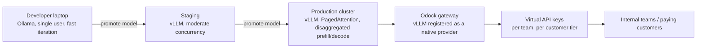
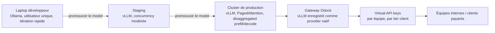

---
{
  "slug": "self-host-llms-with-ollama-and-vllm-and-distribute-them-with-odock",
  "category": "AI Gateway",
  "title": "From Laptop to Production: Self-Host LLMs with Ollama and vLLM, Then Distribute Them Like a Pro with Odock",
  "seoTitle": "Ollama vs vLLM: Self-Host LLMs and Distribute with Odock",
  "description": "Ollama and vLLM made self-hosted, open-weight models a credible production option in 2026. Learn the practical split between the two, and how to put a self-hosted model behind Odock to give it governed, multi-tenant distribution with virtual keys, pricing, and full audit records.",
  "excerpt": "You can prototype on Ollama in an afternoon and serve real production traffic on vLLM at 6x the throughput. The part most guides skip is what happens next: turning that self-hosted model into something you can safely hand out to teams, customers, or a pro tier with proper access control and billing.",
  "publishedAt": "2026-07-17",
  "updatedAt": "2026-07-17",
  "readingTime": "12 min",
  "keywords": [
    "ollama vs vllm",
    "self-hosted llm",
    "local llm production",
    "vllm production deployment",
    "distribute llm access",
    "odock self-host",
    "open weight model hosting"
  ],
  "heroEyebrow": "Self-hosted AI",
  "intro": "Running your own model stopped being a hobbyist weekend project in 2026. Ollama makes it trivial to run a capable open-weight model on a laptop in minutes, and vLLM turns that same class of model into a production inference service that can genuinely compete with hosted APIs on cost and throughput. What most tutorials stop short of is the part that actually matters for a business: once the model is running, how do you hand access to it out to your team, your customers, or a paid tier, without everyone sharing one unguarded endpoint. This is the full path, from a local Ollama prototype to a governed, billable, multi-tenant service behind Odock.",
  "keyTakeaways": [
    "Ollama and vLLM solve different problems: Ollama is the fastest way to prototype with a local model, vLLM is what production traffic actually needs, with roughly 6x the throughput of Ollama under concurrent load, growing to over 16x on newer GPUs at scale.",
    "A single GPU running vLLM can be materially cheaper than calling a hosted frontier API once you clear a few hundred requests per hour, but only if you also solve access control, multi-tenancy, and billing, which raw vLLM does not provide out of the box.",
    "Odock treats a self-hosted vLLM (or Ollama) deployment as just another provider behind the gateway, which means your self-hosted model gets the same virtual keys, budgets, pricing, and usage records as any hosted provider, and can be distributed to internal teams or paying customers as a governed product."
  ],
  "faq": [
    {
      "question": "Should I use Ollama or vLLM for my self-hosted model?",
      "answer": "Use Ollama for local development, prototyping, and low-traffic internal tools, it is built for exactly that and gets you running in minutes. Move to vLLM once you have real concurrent traffic to serve, its PagedAttention memory management and disaggregated prefill/decode architecture are built specifically for production throughput, delivering roughly 6x the tokens per second of Ollama under concurrent load in 2026 benchmarks, a gap that widens further on newer GPU generations."
    },
    {
      "question": "Is self-hosting actually cheaper than calling a hosted API?",
      "answer": "It can be, but the breakeven depends on volume. At roughly 500 or more requests per hour with typical output lengths, a single well-utilised GPU running vLLM can run about 70% cheaper than an equivalent volume of hosted frontier API calls, with the breakeven point generally landing around 150-200 requests per hour. Below that volume, the fixed cost of GPU capacity you are not fully using usually makes a hosted API cheaper."
    },
    {
      "question": "How do I safely give my team or customers access to a model I am self-hosting?",
      "answer": "Do not point application code directly at the vLLM or Ollama endpoint. Register it as a provider inside a gateway like Odock, so every caller gets a scoped virtual API key with its own model access grant, budget, and usage record, instead of a shared bearer token to a raw inference server. That is what turns 'a model running on my GPU' into a product you can actually distribute and bill for."
    }
  ],
  "relatedSlugs": [
    "the-great-model-churn-of-2026-why-model-agnostic-routing-matters",
    "how-to-control-llm-costs-with-virtual-api-keys-budgets-and-quotas",
    "how-to-design-multi-provider-llm-routing-and-failover",
    "what-is-an-llm-gateway-and-why-ai-teams-need-one"
  ],
  "cta": {
    "title": "Turn your self-hosted model into a governed product",
    "description": "Odock connects to your Ollama or vLLM endpoint like any other provider, then wraps it with virtual API keys, budgets, quotas, guardrails, and usage records, so you can distribute access to teams or paying customers without building that layer yourself.",
    "primaryLabel": "Request a demo",
    "primaryHref": "#waitlist-section",
    "secondaryLabel": "Explore self-hosting",
    "secondaryHref": "https://docs.odock.ai/docs/self-host/"
  },
  "locales": {
    "fr": {
      "category": "AI Gateway",
      "title": "Du laptop à la production : self-host vos LLMs avec Ollama et vLLM, puis distribuez-les comme un pro avec Odock",
      "seoTitle": "Ollama vs vLLM : self-host de LLMs et distribution avec Odock",
      "description": "Ollama et vLLM ont fait des models open-weight self-hosted une option de production crédible en 2026. Découvrez la répartition pratique des rôles entre les deux, et comment placer un model self-hosted derrière Odock pour lui offrir une distribution multi-tenant gouvernée, avec virtual keys, pricing et audit records complets.",
      "excerpt": "Vous pouvez prototyper sur Ollama en un après-midi, puis servir du trafic de production réel sur vLLM avec un throughput 6x supérieur. La partie que la plupart des guides passent sous silence, c'est la suite : transformer ce model self-hosted en quelque chose que vous pouvez distribuer en toute sécurité à des équipes, des clients ou un tier pro, avec un contrôle d'accès et une facturation appropriés.",
      "heroEyebrow": "IA self-hosted",
      "intro": "Faire tourner son propre model a cessé d'être un projet de week-end pour hobbyiste en 2026. Ollama permet de faire tourner un model open-weight performant sur un laptop en quelques minutes, et vLLM transforme ce même type de model en un service d'inference de production capable de rivaliser réellement avec les APIs hosted en coût comme en throughput. Ce que la plupart des tutoriels n'abordent pas, c'est la partie qui compte vraiment pour une entreprise : une fois le model lancé, comment en distribuer l'accès à votre équipe, vos clients ou un tier payant, sans que tout le monde partage un seul endpoint non gouverné. Voici le chemin complet, du prototype Ollama local jusqu'au service multi-tenant gouverné et facturable derrière Odock.",
      "keyTakeaways": [
        "Ollama et vLLM résolvent des problèmes différents : Ollama est le moyen le plus rapide de prototyper avec un model local, vLLM est ce dont le trafic de production a réellement besoin, avec environ 6x le throughput d'Ollama en charge concurrente, un écart qui dépasse 16x sur les GPU récents à grande échelle.",
        "Un seul GPU faisant tourner vLLM peut être nettement moins cher qu'un appel à une API frontier hosted dès lors que vous dépassez quelques centaines de requêtes par heure, mais uniquement si vous résolvez aussi le contrôle d'accès, la multi-tenancy et la facturation, que vLLM brut ne fournit pas nativement.",
        "Odock traite un déploiement vLLM (ou Ollama) self-hosted comme un provider parmi d'autres derrière la gateway, ce qui signifie que votre model self-hosted bénéficie des mêmes virtual keys, budgets, pricing et usage records que n'importe quel provider hosted, et peut être distribué à des équipes internes ou des clients payants comme un produit gouverné."
      ],
      "cta": {
        "title": "Transformez votre model self-hosted en produit gouverné",
        "description": "Odock se connecte à votre endpoint Ollama ou vLLM comme à n'importe quel autre provider, puis l'enveloppe de virtual API keys, budgets, quotas, guardrails et usage records, afin que vous puissiez distribuer l'accès à des équipes ou des clients payants sans construire cette couche vous-même.",
        "primaryLabel": "Demander une démo",
        "secondaryLabel": "Découvrir le self-hosting"
      },
      "readingTime": "12 min",
      "keywords": [
        "ollama vs vllm",
        "llm self-hosted",
        "llm local en production",
        "déploiement vllm production",
        "distribution d'accès llm",
        "odock self-host",
        "hébergement de model open-weight"
      ],
      "faq": [
        {
          "question": "Faut-il utiliser Ollama ou vLLM pour mon model self-hosted ?",
          "answer": "Utilisez Ollama pour le développement local, le prototypage et les outils internes à faible trafic : c'est exactement ce pour quoi il est conçu, et il vous met en route en quelques minutes. Passez à vLLM dès que vous avez un vrai trafic concurrent à servir : sa gestion mémoire PagedAttention et son architecture disaggregated prefill/decode sont spécifiquement conçues pour le throughput de production, délivrant environ 6x les tokens par seconde d'Ollama en charge concurrente selon les benchmarks 2026, un écart qui se creuse encore sur les générations de GPU récentes."
        },
        {
          "question": "Le self-hosting est-il vraiment moins cher qu'un appel à une API hosted ?",
          "answer": "Cela peut être le cas, mais le seuil de rentabilité dépend du volume. À partir d'environ 500 requêtes par heure ou plus, avec des longueurs de sortie typiques, un seul GPU bien utilisé faisant tourner vLLM peut coûter environ 70% de moins qu'un volume équivalent d'appels à une API frontier hosted, le point d'équilibre se situant généralement autour de 150-200 requêtes par heure. En dessous de ce volume, le coût fixe d'une capacité GPU sous-utilisée rend généralement une API hosted moins chère."
        },
        {
          "question": "Comment donner à mon équipe ou à mes clients un accès sécurisé à un model que je self-host ?",
          "answer": "Ne pointez pas votre code applicatif directement vers l'endpoint vLLM ou Ollama. Enregistrez-le comme provider dans une gateway telle qu'Odock, afin que chaque appelant reçoive une virtual API key scopée, avec son propre model access grant, son budget et son usage record, plutôt qu'un bearer token partagé vers un serveur d'inference brut. C'est ce qui transforme « un model qui tourne sur mon GPU » en un produit que vous pouvez réellement distribuer et facturer."
        }
      ]
    }
  }
}
---
<!-- locale:en -->
## Two tools, two very different jobs

Ollama and vLLM get compared constantly in 2026, and the comparison usually implies you have to pick one. In practice they solve different problems and most serious deployments end up using both, at different points in the same model's life.

Ollama is built for one-command simplicity. Pull a model, run it, and you have a local endpoint in minutes, no GPU cluster configuration, no serving framework tuning. That makes it the right default for local development, prototyping a feature against a real model, or running a low-traffic internal tool where a handful of requests a minute is the entire load. Benchmarks in 2026 put Ollama at around 62 tokens per second on a model like Llama 3.1 8B for a single user, which is fine for one person iterating, and increasingly strained the moment real concurrency shows up.

vLLM is built for the opposite end of that spectrum. Its PagedAttention memory management dramatically reduces the memory waste that limits how many concurrent requests a GPU can serve, and its disaggregated prefill/decode architecture, introduced across 2025 and 2026 releases, separates the compute-heavy prompt-processing phase from the memory-bandwidth-heavy token-generation phase, so each can be scheduled and hardware-matched independently. The result shows up directly in benchmarks: vLLM sustains around 920 tokens per second under 50 concurrent users on the same model class where Ollama manages 62, a roughly 6x throughput advantage that widens to over 16x on newer Blackwell-generation GPUs at scale. If Ollama is where you confirm a model works, vLLM is what you put in front of real traffic.

## When self-hosting actually pays for itself

Self-hosting is not automatically cheaper, and pretending otherwise leads to bad capacity decisions. The economics in 2026 point at a fairly clear breakeven: at roughly 500 or more requests per hour with typical output lengths, a single well-utilised A100-class GPU running vLLM runs about 70% cheaper than calling an equivalent volume of hosted frontier API traffic, with the crossover point generally sitting around 150-200 requests per hour. Below that volume, you are usually paying for idle GPU capacity, and a hosted API wins on cost even before you account for the operational effort of running your own inference stack.

This is also exactly where [the rise of genuinely competitive open-weight models](/blog/the-great-model-churn-of-2026-why-model-agnostic-routing-matters/) changes the calculation. A few years ago, self-hosting meant accepting a capability gap versus the frontier proprietary options. In 2026 that gap has narrowed enough, with models like GLM-5.2 leading specific benchmark categories and Gemma 4 running credibly on modest hardware, that self-hosting is a capability decision as much as a cost one for a growing set of workloads.

## The step most guides skip: distribution

Here is where the typical self-hosting tutorial ends, and where the actual business problem starts. A vLLM or Ollama endpoint by itself is a single bearer-token API with no concept of who is calling it, no per-caller budget, no per-caller access grant, and no usage ledger you could hand to finance or a customer. That is fine for a single developer's laptop. It falls apart the moment you want to:

- let more than one internal team call the model without sharing one token and one blast radius,
- offer the model as a paid "pro" tier to customers with different access levels,
- track who is spending what, so a runaway workload does not silently exhaust your GPU budget,
- apply the same guardrails and audit trail you already require for hosted-provider traffic.

Solving all of that yourself means building an auth layer, a metering layer, a pricing layer, and a logging layer on top of an inference server that was never designed to be any of those things. This is precisely the gap a gateway is for.

## Registering a self-hosted model as a provider in Odock

Odock's routing layer already treats `vllm` as a native provider family alongside OpenAI, Anthropic, Gemini, and Mistral, meaning your self-hosted endpoint is not a special case bolted onto the gateway, it is a first-class provider. The path from "a model is running on my hardware" to "a model my org or my customers can safely call" looks like this:

1. **Point Odock at your inference endpoint.** Whether it is a vLLM server exposing an OpenAI-compatible API or an Ollama instance, you register it the same way you would any provider, storing the endpoint and credentials as an encrypted [provider key](https://docs.odock.ai/docs/models-and-mcp/providers/add-provider-key/) that never touches application code.

2. **Add the model.** Use [add a model manually](https://docs.odock.ai/docs/models-and-mcp/models/add-model-manually/) to map a stable client-facing name to your self-hosted model, so callers never need to know or care which GPU, which vLLM instance, or which model revision actually serves the request.

3. **Set pricing, even for infrastructure you own.** [Model pricing](https://docs.odock.ai/docs/models-and-mcp/models/model-pricing/) is not only for metering hosted-API spend, it is how you attribute the real cost of your own GPU capacity across the teams or customers using it, and it is the mechanism that turns a self-hosted model into something you can actually charge for in a pro tier.

4. **Issue scoped virtual API keys per consumer.** Instead of one shared token to your inference server, each team, application, or customer gets its own [virtual API key](https://docs.odock.ai/docs/management/virtual-api-keys/) with explicit [model access grants](https://docs.odock.ai/docs/models-and-mcp/models/grant-model-to-api-key/), so access can be revoked or scoped down for one caller without affecting anyone else.

5. **Add budgets and quotas per tier.** A free tier and a pro tier calling the same underlying self-hosted model can carry entirely different [budgets](https://docs.odock.ai/docs/management/budgets/) and [quotas](https://docs.odock.ai/docs/management/quotas/), so your own GPU capacity is protected from any single caller the same way a hosted provider protects its capacity from you.

6. **Turn on the same guardrails as everything else.** Self-hosted does not mean unmonitored. Prompt and response inspection through [SafetySec](https://docs.odock.ai/docs/security-and-guardrails/safetysec-engine/) applies to your own model exactly as it does to a hosted one.

7. **Watch usage per key.** Every call produces a [usage record](https://docs.odock.ai/docs/observability/usage-records/) with identity, tokens, latency, and cost, which is what lets you actually report on and bill for a self-hosted "pro" offering instead of guessing at GPU utilisation from infrastructure metrics alone.

## What "distribute your models as a pro" looks like end to end

Put the pieces together and the pattern is straightforward: prototype on Ollama, promote the validated model to a vLLM deployment sized for your expected concurrency, register that vLLM endpoint as a provider in Odock, and issue scoped virtual keys to whoever should be able to call it, whether that is your own product team, an internal tool, or an external customer paying for elevated access. The customer or team never talks to your GPU directly. They talk to a virtual key, scoped to exactly the model and quota you decided, with every call logged and priced.

This is also how a self-hosted deployment stays consistent with the rest of your AI estate rather than becoming a second, ungoverned system living outside it. If you already route hosted-provider traffic through Odock for budgets, guardrails, and audit records, a self-hosted vLLM deployment slots into the same catalog, the same access-grant model, and the same observability, covered in the [self-host stack overview](https://docs.odock.ai/docs/self-host/) if you are also considering self-hosting the gateway itself alongside your inference layer.

## The honest limits here

Self-hosting shifts effort, it does not remove it. You are trading a per-token bill for GPU procurement, capacity planning, and the operational work of keeping an inference service healthy, which is a real cost even when the per-request economics favour you. Sizing wrong in either direction is common: underprovisioned capacity reintroduces the latency problems you were trying to escape, overprovisioned capacity quietly erodes the cost advantage that justified self-hosting in the first place. None of that changes based on which gateway sits in front of the deployment, it is a genuine infrastructure decision that deserves its own capacity plan.

## Where Odock.ai comes in

I built Odock's provider layer so that a self-hosted vLLM or Ollama deployment is never a second-class citizen next to a hosted API, so take this with that context in mind. Once your model is registered as a provider, it gets the same virtual keys, budgets, quotas, guardrails, and usage records as OpenAI, Anthropic, or any other provider in your catalog, which is what actually makes "distribute this model to a pro tier" a safe, billable, auditable decision instead of a shared token and a hope.

If you already have a model running on Ollama or vLLM and are looking for the fastest way to turn it into something teams or customers can use without babysitting a shared endpoint, [request a demo](#waitlist-section) or start with [self-hosting at Odock](https://docs.odock.ai/docs/self-host/) and put your own infrastructure behind the same control plane as everything else you run.

## Sources

- [The 2026 Definitive Guide to Running Local LLMs in Production, SitePoint](https://www.sitepoint.com/the-2026-definitive-guide-to-running-local-llms-in-production/)
- [vLLM vs Ollama: Which LLM Framework Should You Use in 2026?, Kanerika](https://kanerika.com/blogs/vllm-vs-ollama/)
- [Local LLM Deployment 2026: Ollama vs vLLM Tuning, QubitTool](https://qubittool.com/blog/local-llm-deployment-2026-ollama-vllm-optimization)
- [Odock Hugging Face provider](https://docs.odock.ai/docs/models-and-mcp/providers/huggingface/)
- [Odock virtual API keys](https://docs.odock.ai/docs/management/virtual-api-keys/)
- [Odock self-host overview](https://docs.odock.ai/docs/self-host/)

<!-- locale:fr -->
## Deux outils, deux métiers très différents

Ollama et vLLM sont constamment comparés en 2026, et cette comparaison sous-entend en général qu'il faut choisir l'un ou l'autre. En pratique, ils résolvent des problèmes différents, et la plupart des déploiements sérieux finissent par utiliser les deux, à différents moments de la vie d'un même model.

Ollama est conçu pour une simplicité en une commande. Vous pullez un model, vous le lancez, et vous disposez d'un endpoint local en quelques minutes, sans configuration de cluster GPU ni tuning du serving framework. C'est le choix par défaut pour le développement local, le prototypage d'une feature face à un vrai model, ou l'exploitation d'un outil interne à faible trafic où quelques requêtes par minute constituent toute la charge. Les benchmarks 2026 situent Ollama autour de 62 tokens par seconde sur un model comme Llama 3.1 8B pour un seul utilisateur, ce qui convient parfaitement à une personne qui itère, mais qui devient de plus en plus tendu dès que la vraie concurrency apparaît.

vLLM se situe à l'autre extrémité de ce spectre. Sa gestion mémoire PagedAttention réduit considérablement le gaspillage mémoire qui limite le nombre de requêtes concurrentes qu'un GPU peut servir, et son architecture disaggregated prefill/decode, introduite au fil des releases 2025 et 2026, sépare la phase de traitement du prompt, gourmande en calcul, de la phase de génération de tokens, gourmande en bande passante mémoire, afin que chacune puisse être ordonnancée et associée au hardware indépendamment. Le résultat se voit directement dans les benchmarks : vLLM soutient environ 920 tokens par seconde avec 50 utilisateurs concurrents sur la même catégorie de model où Ollama plafonne à 62, soit un avantage de throughput d'environ 6x, qui dépasse 16x sur les GPU récents de génération Blackwell à grande échelle. Si Ollama est l'endroit où vous confirmez qu'un model fonctionne, vLLM est ce que vous placez devant du trafic réel.

## Quand le self-hosting devient réellement rentable

Le self-hosting n'est pas automatiquement moins cher, et prétendre le contraire mène à de mauvaises décisions de capacité. L'économie en 2026 pointe vers un seuil de rentabilité assez net : à partir d'environ 500 requêtes par heure ou plus, avec des longueurs de sortie typiques, un seul GPU de classe A100 bien utilisé faisant tourner vLLM coûte environ 70% de moins qu'un volume équivalent de trafic vers une API frontier hosted, le point de bascule se situant généralement autour de 150-200 requêtes par heure. En dessous de ce volume, vous payez généralement pour une capacité GPU inutilisée, et une API hosted l'emporte sur le coût, même avant de prendre en compte l'effort opérationnel de faire tourner votre propre stack d'inference.

C'est également précisément là que [la montée en puissance de models open-weight réellement compétitifs](/fr/blog/the-great-model-churn-of-2026-why-model-agnostic-routing-matters/) change le calcul. Il y a quelques années, self-hoster signifiait accepter un écart de capacité par rapport aux options propriétaires frontier. En 2026, cet écart s'est suffisamment réduit, avec des models comme GLM-5.2 en tête de catégories de benchmark spécifiques et Gemma 4 tournant de façon crédible sur du hardware modeste, pour que le self-hosting devienne autant une décision de capacité qu'une décision de coût pour un nombre croissant de workloads.

## L'étape que la plupart des guides oublient : la distribution

C'est ici que s'arrête le tutoriel type sur le self-hosting, et c'est là que commence le vrai problème business. Un endpoint vLLM ou Ollama, à lui seul, n'est qu'une API à bearer-token unique, sans notion de qui l'appelle, sans budget par appelant, sans access grant par appelant, et sans ledger d'usage que vous pourriez remettre à la finance ou à un client. Cela convient parfaitement au laptop d'un seul développeur. Cela s'effondre dès que vous voulez :

- permettre à plusieurs équipes internes d'appeler le model sans partager un seul token et un seul blast radius,
- proposer le model comme un tier « pro » payant à des clients avec des niveaux d'accès différents,
- suivre qui dépense quoi, afin qu'un workload incontrôlé n'épuise pas silencieusement votre budget GPU,
- appliquer les mêmes guardrails et le même audit trail que ceux déjà exigés pour le trafic vers des providers hosted.

Résoudre tout cela vous-même implique de construire une couche d'auth, une couche de metering, une couche de pricing et une couche de logging au-dessus d'un serveur d'inference qui n'a jamais été conçu pour remplir ces fonctions. C'est précisément le vide qu'une gateway comble.

## Enregistrer un model self-hosted comme provider dans Odock

La couche de routing d'Odock traite déjà `vllm` comme une famille de provider native, au même titre qu'OpenAI, Anthropic, Gemini et Mistral, ce qui signifie que votre endpoint self-hosted n'est pas un cas particulier greffé sur la gateway, mais un provider de premier rang. Le chemin entre « un model tourne sur mon hardware » et « un model que mon organisation ou mes clients peuvent appeler en toute sécurité » ressemble à ceci :

1. **Pointez Odock vers votre endpoint d'inference.** Qu'il s'agisse d'un serveur vLLM exposant une API compatible OpenAI ou d'une instance Ollama, vous l'enregistrez de la même manière que n'importe quel provider, en stockant l'endpoint et les credentials sous forme de [provider key](https://docs.odock.ai/docs/models-and-mcp/providers/add-provider-key/) chiffrée qui ne transite jamais par le code applicatif.

2. **Ajoutez le model.** Utilisez [add a model manually](https://docs.odock.ai/docs/models-and-mcp/models/add-model-manually/) pour associer un nom stable, visible côté client, à votre model self-hosted, afin que les appelants n'aient jamais besoin de savoir, ni de se soucier, quel GPU, quelle instance vLLM ou quelle révision du model sert réellement la requête.

3. **Définissez un pricing, même pour une infrastructure que vous possédez.** Le [model pricing](https://docs.odock.ai/docs/models-and-mcp/models/model-pricing/) ne sert pas uniquement à mesurer les dépenses d'API hosted : c'est le moyen d'attribuer le coût réel de votre propre capacité GPU entre les équipes ou les clients qui l'utilisent, et c'est le mécanisme qui transforme un model self-hosted en quelque chose que vous pouvez réellement facturer dans un tier pro.

4. **Émettez des virtual API keys scopées par consommateur.** Plutôt qu'un seul token partagé vers votre serveur d'inference, chaque équipe, application ou client reçoit sa propre [virtual API key](https://docs.odock.ai/docs/management/virtual-api-keys/) avec des [model access grants](https://docs.odock.ai/docs/models-and-mcp/models/grant-model-to-api-key/) explicites, afin que l'accès puisse être révoqué ou restreint pour un appelant sans affecter les autres.

5. **Ajoutez des budgets et des quotas par tier.** Un tier gratuit et un tier pro qui appellent le même model self-hosted sous-jacent peuvent avoir des [budgets](https://docs.odock.ai/docs/management/budgets/) et des [quotas](https://docs.odock.ai/docs/management/quotas/) entièrement différents, afin que votre propre capacité GPU soit protégée de n'importe quel appelant, de la même manière qu'un provider hosted protège sa capacité de vous.

6. **Activez les mêmes guardrails que pour le reste.** Self-hosted ne veut pas dire non surveillé. L'inspection des prompts et des réponses via [SafetySec](https://docs.odock.ai/docs/security-and-guardrails/safetysec-engine/) s'applique à votre propre model exactement comme à un model hosted.

7. **Surveillez l'usage par key.** Chaque appel produit un [usage record](https://docs.odock.ai/docs/observability/usage-records/) avec l'identité, les tokens, la latency et le coût, ce qui vous permet de réellement reporter et facturer une offre « pro » self-hosted, plutôt que de deviner l'utilisation GPU à partir des seules métriques d'infrastructure.

## À quoi ressemble « distribuer vos models comme un pro », de bout en bout

En assemblant les pièces, le pattern est simple : vous prototypez sur Ollama, vous promouvez le model validé vers un déploiement vLLM dimensionné pour la concurrency attendue, vous enregistrez cet endpoint vLLM comme provider dans Odock, puis vous émettez des virtual keys scopées pour quiconque doit pouvoir l'appeler, que ce soit votre propre équipe produit, un outil interne, ou un client externe qui paie pour un accès élevé. Le client ou l'équipe ne parle jamais directement à votre GPU. Il parle à une virtual key, scopée exactement au model et au quota que vous avez décidés, avec chaque appel loggé et facturé.

C'est aussi ce qui permet à un déploiement self-hosted de rester cohérent avec le reste de votre parc IA, plutôt que de devenir un second système, non gouverné, vivant en dehors de celui-ci. Si vous routez déjà le trafic vers des providers hosted via Odock pour les budgets, les guardrails et les audit records, un déploiement vLLM self-hosted s'intègre dans le même catalogue, la même politique d'access grants et la même observability — un point détaillé dans la [vue d'ensemble du self-host stack](https://docs.odock.ai/docs/self-host/) si vous envisagez également de self-hoster la gateway elle-même en plus de votre couche d'inference.

## Les limites honnêtes

Le self-hosting déplace l'effort, il ne le supprime pas. Vous échangez une facture au token contre l'achat de GPU, la planification de capacité et le travail opérationnel nécessaire pour maintenir un service d'inference en bonne santé, ce qui représente un coût réel même quand l'économie par requête joue en votre faveur. Un mauvais dimensionnement, dans un sens comme dans l'autre, est fréquent : une capacité sous-dimensionnée réintroduit les problèmes de latency que vous cherchiez à fuir, une capacité surdimensionnée érode silencieusement l'avantage de coût qui justifiait le self-hosting au départ. Rien de tout cela ne change selon la gateway placée devant le déploiement : c'est une véritable décision d'infrastructure, qui mérite son propre plan de capacité.

## Là où Odock.ai intervient

J'ai conçu la couche provider d'Odock pour qu'un déploiement vLLM ou Ollama self-hosted ne soit jamais un citoyen de seconde zone face à une API hosted, donc gardez ce contexte en tête. Une fois votre model enregistré comme provider, il bénéficie des mêmes virtual keys, budgets, quotas, guardrails et usage records qu'OpenAI, Anthropic ou n'importe quel autre provider de votre catalogue, ce qui est précisément ce qui transforme « distribuer ce model dans un tier pro » en une décision sûre, facturable et auditable, plutôt qu'un token partagé et un espoir.

Si vous avez déjà un model qui tourne sur Ollama ou vLLM et que vous cherchez le moyen le plus rapide d'en faire quelque chose que vos équipes ou vos clients peuvent utiliser sans surveiller un endpoint partagé, [demandez une démo](#waitlist-section) ou commencez avec le [self-hosting chez Odock](https://docs.odock.ai/docs/self-host/), et placez votre propre infrastructure derrière le même control plane que tout ce que vous exploitez déjà.

## Sources

- [The 2026 Definitive Guide to Running Local LLMs in Production, SitePoint](https://www.sitepoint.com/the-2026-definitive-guide-to-running-local-llms-in-production/)
- [vLLM vs Ollama: Which LLM Framework Should You Use in 2026?, Kanerika](https://kanerika.com/blogs/vllm-vs-ollama/)
- [Local LLM Deployment 2026: Ollama vs vLLM Tuning, QubitTool](https://qubittool.com/blog/local-llm-deployment-2026-ollama-vllm-optimization)
- [Provider Hugging Face Odock](https://docs.odock.ai/docs/models-and-mcp/providers/huggingface/)
- [Virtual API keys Odock](https://docs.odock.ai/docs/management/virtual-api-keys/)
- [Vue d'ensemble self-host Odock](https://docs.odock.ai/docs/self-host/)
