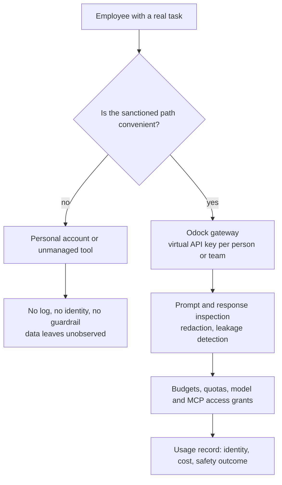
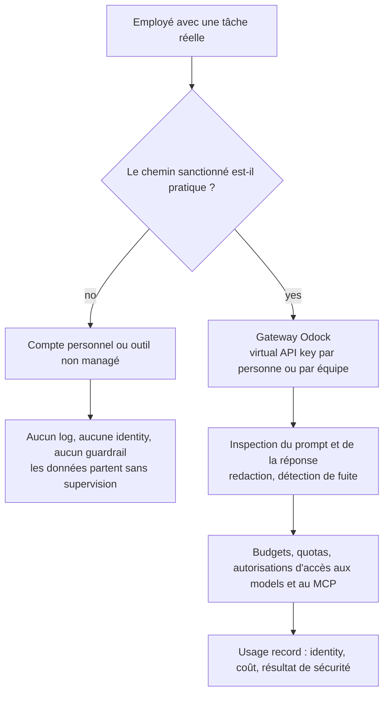

---
{
  "slug": "shadow-ai-2026-how-to-govern-unsanctioned-ai-tool-use",
  "category": "AI Governance",
  "title": "Shadow AI in 2026: Why Banning Tools Fails and Governed Enablement Wins",
  "seoTitle": "Shadow AI 2026: How to Govern Unsanctioned AI Tool Use",
  "description": "Shadow AI detections quadrupled in a year and 67% of employees now use AI tools IT never approved. Here is why blocking access does not work, what governed enablement looks like, and how a gateway turns shadow AI into sanctioned, logged traffic.",
  "excerpt": "Two-thirds of employees are already pasting real company data into AI tools nobody approved. The instinct is to block. The data says that fails. Here is the governed-enablement pattern that actually closes the gap, and how a gateway makes it real.",
  "publishedAt": "2026-07-17",
  "updatedAt": "2026-07-17",
  "readingTime": "11 min",
  "keywords": [
    "shadow ai",
    "shadow ai 2026",
    "ai governance",
    "unsanctioned ai tools",
    "ai data leakage",
    "governed ai enablement",
    "ai gateway shadow ai"
  ],
  "heroEyebrow": "AI governance",
  "intro": "Shadow IT used to mean an unapproved SaaS subscription on someone's expense report. Shadow AI is a different animal: it means source code, client proposals, and HR records typed into a chat box that nobody in security has ever heard of. In 2026 the data on this problem stopped being anecdotal. It is now measured, it is large, and it keeps growing faster than most security teams' response plans. This is what the numbers say, why the instinct to simply block AI tools keeps failing, and what a governed-enablement architecture looks like when it actually works.",
  "keyTakeaways": [
    "Shadow AI is no longer a fringe risk: detections are rising sharply year over year, most employees already use AI tools at work, and most organisations lack a formal AI security policy to govern that use.",
    "Blocking access does not remove the behaviour, it removes the visibility. Prohibition-only policies push usage to personal devices and unmanaged accounts where there is no log at all.",
    "The pattern that works is governed enablement: give people a sanctioned, equally convenient path through a gateway with identity, logging, and guardrails, so the desire to use AI is met instead of denied."
  ],
  "faq": [
    {
      "question": "Is shadow AI just a bigger version of shadow IT?",
      "answer": "The mechanism is similar, an unapproved tool fills a gap the sanctioned stack does not cover, but the blast radius is different. A shadow SaaS tool might store a spreadsheet. A shadow AI tool ingests the prompt itself, which means whatever a person pastes, including source code, contract terms, or patient data, leaves the organisation's control the moment the request is sent."
    },
    {
      "question": "Why doesn't blocking AI websites and apps solve the problem?",
      "answer": "Because the underlying need, using AI to move faster, does not go away when the sanctioned path is removed. Employees route around blocks with personal phones, personal accounts, or browser extensions IT cannot see. The result is the same data exposure with none of the visibility, which is worse than the starting point."
    },
    {
      "question": "What is 'governed enablement' concretely?",
      "answer": "It means routing all AI usage, including experimentation, through one gateway with identity-bound credentials, so every request is attributable, budgeted, and inspectable, while still giving people fast access to the models and tools they actually want. The goal is to make the sanctioned path the easiest path, not just the compliant one."
    }
  ],
  "relatedSlugs": [
    "why-the-ai-gateway-became-mandatory-infrastructure-in-2026",
    "prompt-injection-data-leakage-and-llm-security-guardrails",
    "ai-agent-identity-and-non-human-identity-security-in-2026",
    "iso-42001-vs-nist-ai-rmf-vs-eu-ai-act-ai-governance-frameworks-compared"
  ],
  "cta": {
    "title": "Give employees a sanctioned path faster than shadow AI",
    "description": "Odock gives every team a governed, OpenAI-compatible endpoint to the models and tools they already want, with virtual keys, budgets, and guardrails built into the request path from day one.",
    "primaryLabel": "Request a demo",
    "primaryHref": "#waitlist-section",
    "secondaryLabel": "Explore the LLM gateway",
    "secondaryHref": "/llm-gateway/"
  },
  "locales": {
    "fr": {
      "category": "AI Governance",
      "title": "Shadow AI en 2026 : pourquoi bannir les outils échoue et pourquoi le governed enablement gagne",
      "seoTitle": "Shadow AI 2026 : comment gouverner l'usage d'outils IA non autorisés",
      "description": "Les détections de shadow AI ont quadruplé en un an et 67 % des employés utilisent désormais des outils IA jamais approuvés par l'IT. Voici pourquoi bloquer l'accès ne fonctionne pas, à quoi ressemble le governed enablement, et comment une gateway transforme le shadow AI en trafic sanctionné et loggé.",
      "excerpt": "Deux tiers des employés collent déjà de vraies données d'entreprise dans des outils IA que personne n'a approuvés. Le réflexe est de bloquer. Les données montrent que cela échoue. Voici le pattern de governed enablement qui comble réellement cet écart, et comment une gateway le rend concret.",
      "heroEyebrow": "AI governance",
      "intro": "Le shadow IT désignait autrefois un abonnement SaaS non approuvé glissé dans une note de frais. Le shadow AI est une tout autre bête : cela signifie du code source, des propositions client et des dossiers RH tapés dans une chat box dont personne en sécurité n'a jamais entendu parler. En 2026, les données sur ce problème ont cessé d'être anecdotiques. Elles sont désormais mesurées, importantes, et progressent plus vite que la plupart des plans de réponse des équipes de sécurité. Voici ce que disent les chiffres, pourquoi le réflexe consistant à simplement bloquer les outils IA continue d'échouer, et à quoi ressemble une architecture de governed enablement quand elle fonctionne réellement.",
      "keyTakeaways": [
        "Le shadow AI n'est plus un risque marginal : les détections augmentent fortement d'une année sur l'autre, la plupart des employés utilisent déjà des outils IA au travail, et la plupart des organisations n'ont pas de politique de sécurité IA formelle pour encadrer cet usage.",
        "Bloquer l'accès ne supprime pas le comportement, il supprime la visibilité. Les politiques limitées à l'interdiction poussent l'usage vers des appareils personnels et des comptes non managés, où il n'existe aucun log.",
        "Le pattern qui fonctionne est le governed enablement : offrir aux utilisateurs un chemin sanctionné, tout aussi pratique, via une gateway dotée d'identity, de logging et de guardrails, afin que le besoin d'utiliser l'IA soit satisfait plutôt que refusé."
      ],
      "cta": {
        "title": "Donnez à vos employés un chemin sanctionné plus rapide que le shadow AI",
        "description": "Odock donne à chaque équipe un endpoint governed, compatible OpenAI, vers les models et outils qu'elle utilise déjà, avec virtual keys, budgets et guardrails intégrés au traitement de la requête dès le premier jour.",
        "primaryLabel": "Demander une démo",
        "secondaryLabel": "Explorer la LLM gateway"
      },
      "readingTime": "11 min",
      "keywords": [
        "shadow ai",
        "shadow ai 2026",
        "gouvernance ia",
        "outils ia non autorisés",
        "fuite de données ia",
        "governed enablement ia",
        "ai gateway shadow ai"
      ],
      "faq": [
        {
          "question": "Le shadow AI n'est-il qu'une version plus large du shadow IT ?",
          "answer": "Le mécanisme est similaire : un outil non approuvé comble un manque que la stack sanctionnée ne couvre pas, mais le rayon d'impact est différent. Un outil SaaS shadow peut stocker un tableur. Un outil de shadow AI ingère le prompt lui-même, ce qui signifie que tout ce qu'une personne y colle, y compris du code source, des termes contractuels ou des données patient, échappe au contrôle de l'organisation dès l'envoi de la requête."
        },
        {
          "question": "Pourquoi bloquer les sites et applications IA ne résout-il pas le problème ?",
          "answer": "Parce que le besoin sous-jacent, utiliser l'IA pour aller plus vite, ne disparaît pas lorsque le chemin sanctionné est supprimé. Les employés contournent les blocages via des téléphones personnels, des comptes personnels ou des extensions de navigateur que l'IT ne peut pas voir. Le résultat est la même exposition de données, sans aucune visibilité, ce qui est pire que le point de départ."
        },
        {
          "question": "Qu'est-ce que le « governed enablement » concrètement ?",
          "answer": "Cela signifie faire transiter tout l'usage de l'IA, y compris l'expérimentation, par une seule gateway avec des credentials liées à une identity, afin que chaque requête soit attribuable, budgétée et inspectable, tout en donnant aux utilisateurs un accès rapide aux models et outils qu'ils veulent réellement utiliser. L'objectif est de faire du chemin sanctionné le chemin le plus simple, pas seulement le plus conforme."
        }
      ]
    }
  }
}
---
<!-- locale:en -->
## The numbers stopped being anecdotal

For a while, "shadow AI" was a phrase security teams used to gesture at a vague worry. In 2026 it became a measured category with its own statistics, and the statistics are not subtle. Verizon's 2026 Data Breach Investigations Report found shadow AI detections rising fourfold in a single year, with 45% of employees now regular AI users on corporate devices. Salesforce's 2026 Workforce AI Survey put the broader number at 67% of employees using AI tools at work in some form, against only 18% of organisations that have a formal AI security policy governing that use.

Put those two numbers side by side and the gap is the whole story. Two-thirds of the workforce is already doing it. Fewer than one in five organisations has written down what "doing it safely" means.

The visibility problem compounds the exposure problem. Productiv's 2026 analysis found the average enterprise has 14 distinct AI tools in active use, of which IT is aware of only four or five. That is not a small blind spot, it is most of the picture. And the data flowing into that blind spot is not trivial: Cyberhaven's 2026 AI Adoption and Risk Report found the average employee inputs sensitive data into an AI tool roughly once every three working days. Scale that across a workforce of 100,000 and you get thousands of exposure events daily, each one a potential compliance violation or breach precursor, none of it reviewed by anyone.

The financial number attached to this is not abstract either. The DTEX/Ponemon 2026 Cost of Insider Risks Global Report puts the average annual cost of insider-risk incidents at $19.5 million, up 20% in two years. Shadow AI did not create insider risk, but it gave every employee a frictionless new channel for it.

## Why the instinct to block keeps failing

The natural first response from security teams is to block: deny the domains, restrict the apps, add the tools to the acceptable-use policy's forbidden list. It is an understandable instinct, and it is also the wrong lever, for a reason that has nothing to do with AI specifically.

Blocking a tool does not remove the need that made someone reach for it. It removes the visible version of that need. An engineer who wants a second opinion on a tricky function, a support rep who wants to draft a difficult customer email, an analyst who wants to summarise a long document, all of them have a real task to finish, and a blocked corporate tool does not make the task disappear. It sends them to a personal phone, a personal account, or a browser extension nobody in IT has ever seen. The prompt still gets sent. The data still leaves. The only thing that changes is that now there is no log of it happening.

This is exactly the pattern shadow IT taught the industry over the previous decade, and shadow AI is repeating it at higher speed because the barrier to entry is lower. Signing up for an unsanctioned SaaS tool takes a credit card and an evening. Using an unsanctioned AI tool takes opening a tab. Prohibition-only policies do not close that gap, they just move it somewhere darker.

The organisations getting better outcomes are the ones treating this as an enablement problem rather than a compliance-only problem. Per a 2026 analysis reported by Healthcare Brew, organisations that provide an approved AI tool meeting employee productivity needs see up to an 89% reduction in unauthorised AI use. Not zero, people always find edge cases, but the difference between an 89% reduction and a policy memo nobody reads is the entire ballgame.

## What governed enablement actually looks like

Governed enablement is a specific architecture, not a slogan. It means one sanctioned entry point that is fast enough and capable enough that reaching for it is easier than reaching for an unsanctioned tool, while every request that passes through it is identity-bound, logged, and subject to guardrails the moment it happens rather than discovered after the fact.

Four properties separate a governed-enablement setup from a policy document that nobody follows.

**Identity on every request.** Each person, team, or application gets its own virtual API key rather than a shared password or a personal account nobody tracks. Odock's [virtual API keys](https://docs.odock.ai/docs/management/virtual-api-keys/) attach an organisation, team, or user principal to every call, so "who sent this prompt" stops being a forensic question and becomes a lookup.

**Content-level inspection, not just access control.** Knowing who sent a request is necessary but not sufficient, because the risk lives in the content. Odock's SafetySec engine inspects prompts and responses for sensitive data and redacts or blocks before anything reaches a provider or comes back to the user, which is the difference between a policy that says "don't paste customer data" and infrastructure that actually checks. See the [security engine overview](https://docs.odock.ai/docs/security-and-guardrails/safetysec-engine/).

**Budgets that make sanctioned use cheap and easy to reason about.** Employees do not choose an unsanctioned tool because they love risk, they choose it because it is fast and free of friction. A gateway with sane default budgets and quotas per team keeps the sanctioned path just as frictionless while giving finance and security a real number to look at, using the same [budgets](https://docs.odock.ai/docs/management/budgets/) and [quotas](https://docs.odock.ai/docs/management/quotas/) that already govern application traffic.

**An audit trail by default, not by request.** Every call through the gateway produces a [usage record](https://docs.odock.ai/docs/observability/usage-records/) with identity, model, tokens, cost, and safety outcome. That record is what turns "we think shadow AI usage went down" into "here is the log."

## The MCP and agent dimension

Shadow AI is not only about chat interfaces. As agents and coding assistants gain the ability to call tools through MCP, unsanctioned tool access becomes its own version of the same problem: an agent quietly granted a browser or filesystem tool by a well-meaning developer is functionally the same risk as an employee pasting a document into an unapproved chatbot, except the agent can act on what it reads. The governance model has to extend past prompts to tool calls, which is why MCP access at Odock goes through the same access-grant and policy layer as models, covered in [MCP security](https://docs.odock.ai/docs/models-and-mcp/mcp-servers/security/).

## The honest limits of this approach

Governed enablement reduces shadow AI, it does not eliminate the underlying human behaviour that causes it. People will still find edge cases, new tools launch faster than any catalog can track, and a gateway only governs traffic that actually flows through it. That last point matters: rolling out a gateway without also making it the fastest, least annoying way to reach approved models is how well-intentioned programs quietly fail to get adopted, and the shadow usage keeps happening beside the sanctioned one instead of replacing it.

The fix for that is not more policy language, it is making sure the sanctioned path wins on convenience, not just on compliance. That is an adoption problem as much as a security one, and it deserves the same product attention any internal tool needs to actually get used.

## Where Odock.ai comes in

I built Odock.ai around the belief that governance only works when it is also the easiest path, so take the following with that bias in mind. Odock gives every employee, team, and agent a virtual API key to a single OpenAI-compatible endpoint covering your approved model providers and MCP servers, with SafetySec inspection, budgets, and usage records applied automatically to every call. That means the sanctioned option is not a slower, more bureaucratic alternative to the tool someone would reach for anyway, it is the same convenience with the visibility your security and compliance teams actually need.

If your organisation is somewhere in that 67%-use, 18%-policy gap, the fastest way out is not a new acceptable-use memo. It is a gateway your people will actually want to use. [Request a demo](#waitlist-section) or start with the [Odock LLM gateway](/llm-gateway/) and put a name on every AI request before someone else has to explain why there wasn't one.

## Sources

- [Shadow AI Cybersecurity Risk Spikes as 45% of Workers Use Unsanctioned Tools, Tech Times](https://www.techtimes.com/articles/318438/20260615/shadow-ai-cybersecurity-risk-spikes-45-workers-use-unsanctioned-tools.htm)
- [The Hidden Security Risks of Shadow AI in Enterprises, The Hacker News](https://thehackernews.com/2026/04/the-hidden-security-risks-of-shadow-ai.html)
- [Shadow AI: When Everyone Becomes a Data Leak Waiting to Happen, Kiteworks](https://www.kiteworks.com/cybersecurity-risk-management/shadow-ai-data-leak-risks/)
- [12 Shadow AI Security Risks to Monitor in 2026, Netwrix](https://netwrix.com/en/resources/blog/shadow-ai-security-risks/)
- [Odock security engine](https://docs.odock.ai/docs/security-and-guardrails/safetysec-engine/)
- [Odock virtual API keys](https://docs.odock.ai/docs/management/virtual-api-keys/)

<!-- locale:fr -->
## Les chiffres ont cessé d'être anecdotiques

Pendant un temps, « shadow AI » était une expression que les équipes de sécurité employaient pour désigner une inquiétude vague. En 2026, elle est devenue une catégorie mesurée, avec ses propres statistiques, et ces statistiques ne sont pas discrètes. Le 2026 Data Breach Investigations Report de Verizon a constaté que les détections de shadow AI avaient quadruplé en un an, avec 45 % des employés désormais utilisateurs réguliers d'IA sur des appareils professionnels. Le 2026 Workforce AI Survey de Salesforce situe le chiffre plus large à 67 % des employés utilisant des outils IA au travail sous une forme ou une autre, contre seulement 18 % des organisations disposant d'une politique de sécurité IA formelle encadrant cet usage.

Mettez ces deux chiffres côte à côte et l'écart raconte toute l'histoire. Deux tiers des effectifs le font déjà. Moins d'une organisation sur cinq a formalisé ce que signifie « le faire en sécurité ».

Le problème de visibilité aggrave le problème d'exposition. L'analyse 2026 de Productiv a constaté qu'une entreprise moyenne compte 14 outils IA distincts en usage actif, dont l'IT n'a connaissance que de quatre ou cinq. Ce n'est pas un petit angle mort, c'est la majeure partie du tableau. Et les données qui alimentent cet angle mort ne sont pas anodines : le 2026 AI Adoption and Risk Report de Cyberhaven a constaté que l'employé moyen saisit des données sensibles dans un outil IA environ une fois tous les trois jours ouvrés. Multipliez cela par un effectif de 100 000 personnes et vous obtenez des milliers d'événements d'exposition par jour, chacun étant une violation de conformité potentielle ou un précurseur de breach, sans qu'aucun ne soit examiné par personne.

Le chiffre financier associé n'a rien d'abstrait non plus. Le DTEX/Ponemon 2026 Cost of Insider Risks Global Report situe le coût annuel moyen des incidents d'insider risk à 19,5 millions de dollars, en hausse de 20 % en deux ans. Le shadow AI n'a pas créé l'insider risk, mais il a donné à chaque employé un nouveau canal sans friction pour l'alimenter.

## Pourquoi le réflexe de bloquer continue d'échouer

La première réaction naturelle des équipes de sécurité est de bloquer : refuser les domaines, restreindre les applications, ajouter les outils à la liste des interdits de la politique d'usage acceptable. C'est un réflexe compréhensible, et c'est aussi le mauvais levier, pour une raison qui n'a rien de spécifique à l'IA.

Bloquer un outil ne supprime pas le besoin qui a poussé quelqu'un à y recourir. Cela supprime la version visible de ce besoin. Un ingénieur qui veut un second avis sur une fonction délicate, un chargé de support qui veut rédiger un email client difficile, un analyste qui veut résumer un long document : tous ont une tâche réelle à accomplir, et un outil d'entreprise bloqué ne fait pas disparaître cette tâche. Cela les envoie vers un téléphone personnel, un compte personnel ou une extension de navigateur que personne à l'IT n'a jamais vue. Le prompt est quand même envoyé. Les données partent quand même. La seule chose qui change, c'est qu'il n'existe désormais plus aucun log de l'événement.

C'est exactement le pattern que le shadow IT a enseigné au secteur au cours de la décennie précédente, et le shadow AI le répète à plus grande vitesse parce que la barrière à l'entrée est plus basse. S'inscrire à un outil SaaS non approuvé demande une carte bancaire et une soirée. Utiliser un outil IA non approuvé demande d'ouvrir un onglet. Les politiques limitées à l'interdiction ne comblent pas cet écart, elles le déplacent simplement vers un endroit plus sombre.

Les organisations qui obtiennent de meilleurs résultats sont celles qui traitent ce problème comme un problème d'enablement plutôt que comme un simple problème de conformité. Selon une analyse 2026 rapportée par Healthcare Brew, les organisations qui fournissent un outil IA approuvé répondant aux besoins de productivité des employés constatent une réduction pouvant atteindre 89 % de l'usage IA non autorisé. Pas zéro, les gens trouvent toujours des cas limites, mais la différence entre une réduction de 89 % et une note de politique que personne ne lit change tout.

## À quoi ressemble concrètement le governed enablement

Le governed enablement est une architecture précise, pas un slogan. Cela signifie un point d'entrée sanctionné unique, assez rapide et assez capable pour qu'y recourir soit plus simple que de recourir à un outil non approuvé, tandis que chaque requête qui le traverse est liée à une identity, loggée, et soumise à des guardrails au moment même où elle se produit plutôt que découverte après coup.

Quatre propriétés distinguent un dispositif de governed enablement d'un document de politique que personne ne suit.

**Une identity sur chaque requête.** Chaque personne, équipe ou application dispose de sa propre virtual API key plutôt que d'un mot de passe partagé ou d'un compte personnel que personne ne suit. Les [virtual API keys](https://docs.odock.ai/docs/management/virtual-api-keys/) d'Odock associent une organisation, une équipe ou un principal utilisateur à chaque appel, si bien que « qui a envoyé ce prompt » cesse d'être une question forensique pour devenir une simple recherche.

**Une inspection au niveau du contenu, pas seulement un contrôle d'accès.** Savoir qui a envoyé une requête est nécessaire, mais pas suffisant, car le risque réside dans le contenu. Le moteur SafetySec d'Odock inspecte les prompts et les réponses pour détecter les données sensibles, et effectue une redaction ou un blocage avant que quoi que ce soit n'atteigne un provider ou ne revienne à l'utilisateur, ce qui fait toute la différence entre une politique qui dit « ne collez pas de données client » et une infrastructure qui vérifie réellement. Voir la [présentation du moteur de sécurité](https://docs.odock.ai/docs/security-and-guardrails/safetysec-engine/).

**Des budgets qui rendent l'usage sanctionné économique et facile à raisonner.** Les employés ne choisissent pas un outil non approuvé parce qu'ils aiment le risque, mais parce qu'il est rapide et sans friction. Une gateway dotée de budgets par défaut sensés et de quotas par équipe conserve au chemin sanctionné la même absence de friction, tout en donnant à la finance et à la sécurité un chiffre concret à examiner, grâce aux mêmes [budgets](https://docs.odock.ai/docs/management/budgets/) et [quotas](https://docs.odock.ai/docs/management/quotas/) qui gouvernent déjà le trafic applicatif.

**Une audit trail par défaut, pas sur demande.** Chaque appel passant par la gateway produit un [usage record](https://docs.odock.ai/docs/observability/usage-records/) comprenant l'identity, le model, les tokens, le coût et le résultat de sécurité. C'est cet enregistrement qui transforme « nous pensons que l'usage du shadow AI a baissé » en « voici le log ».

## La dimension MCP et agents

Le shadow AI ne concerne pas uniquement les interfaces de chat. À mesure que les agents et les assistants de code acquièrent la capacité d'appeler des outils via MCP, l'accès non approuvé aux outils devient sa propre version du même problème : un agent auquel un développeur bien intentionné a discrètement accordé un outil de navigateur ou de système de fichiers représente fonctionnellement le même risque qu'un employé collant un document dans un chatbot non approuvé, sauf que l'agent peut agir sur ce qu'il lit. Le modèle de gouvernance doit s'étendre au-delà des prompts pour couvrir les tool calls, ce qui explique pourquoi l'accès MCP chez Odock passe par la même couche d'access grant et de policy que les models, décrite dans [MCP security](https://docs.odock.ai/docs/models-and-mcp/mcp-servers/security/).

## Les limites honnêtes de cette approche

Le governed enablement réduit le shadow AI, il n'élimine pas le comportement humain sous-jacent qui en est la cause. Les gens continueront de trouver des cas limites, de nouveaux outils sont lancés plus vite qu'aucun catalogue ne peut les suivre, et une gateway ne gouverne que le trafic qui la traverse réellement. Ce dernier point compte : déployer une gateway sans en faire aussi le moyen le plus rapide et le moins pénible d'accéder aux models approuvés est la façon dont des programmes bien intentionnés échouent silencieusement à être adoptés, l'usage shadow continuant alors à se produire à côté de l'usage sanctionné au lieu de le remplacer.

La solution n'est pas d'ajouter du texte de politique, mais de s'assurer que le chemin sanctionné l'emporte sur le plan de la commodité, pas seulement sur celui de la conformité. C'est autant un problème d'adoption qu'un problème de sécurité, et cela mérite la même attention produit que n'importe quel outil interne doit recevoir pour être réellement utilisé.

## Là où Odock.ai intervient

J'ai conçu Odock.ai autour de la conviction que la gouvernance ne fonctionne que lorsqu'elle est aussi le chemin le plus simple ; gardez donc ce biais à l'esprit dans ce qui suit. Odock donne à chaque employé, équipe et agent une virtual API key vers un endpoint unique compatible OpenAI couvrant vos providers de models approuvés et vos serveurs MCP, avec inspection SafetySec, budgets et usage records appliqués automatiquement à chaque appel. Cela signifie que l'option sanctionnée n'est pas une alternative plus lente et plus bureaucratique à l'outil que quelqu'un utiliserait de toute façon : c'est la même commodité, avec la visibilité dont vos équipes sécurité et conformité ont réellement besoin.

Si votre organisation se situe quelque part dans cet écart entre 67 % d'usage et 18 % de politique, la sortie la plus rapide n'est pas une nouvelle note d'usage acceptable. C'est une gateway que vos équipes auront réellement envie d'utiliser. [Demandez une démo](#waitlist-section) ou commencez avec la [LLM gateway Odock](/fr/llm-gateway/) et mettez un nom sur chaque requête IA avant que quelqu'un d'autre n'ait à expliquer pourquoi il n'y en avait pas.

## Sources

- [Shadow AI Cybersecurity Risk Spikes as 45% of Workers Use Unsanctioned Tools, Tech Times](https://www.techtimes.com/articles/318438/20260615/shadow-ai-cybersecurity-risk-spikes-45-workers-use-unsanctioned-tools.htm)
- [The Hidden Security Risks of Shadow AI in Enterprises, The Hacker News](https://thehackernews.com/2026/04/the-hidden-security-risks-of-shadow-ai.html)
- [Shadow AI: When Everyone Becomes a Data Leak Waiting to Happen, Kiteworks](https://www.kiteworks.com/cybersecurity-risk-management/shadow-ai-data-leak-risks/)
- [12 Shadow AI Security Risks to Monitor in 2026, Netwrix](https://netwrix.com/en/resources/blog/shadow-ai-security-risks/)
- [Moteur de sécurité Odock](https://docs.odock.ai/docs/security-and-guardrails/safetysec-engine/)
- [Virtual API keys Odock](https://docs.odock.ai/docs/management/virtual-api-keys/)
