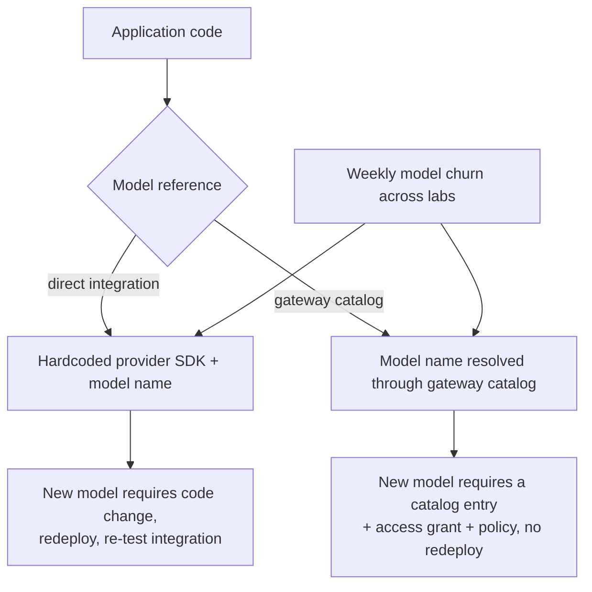
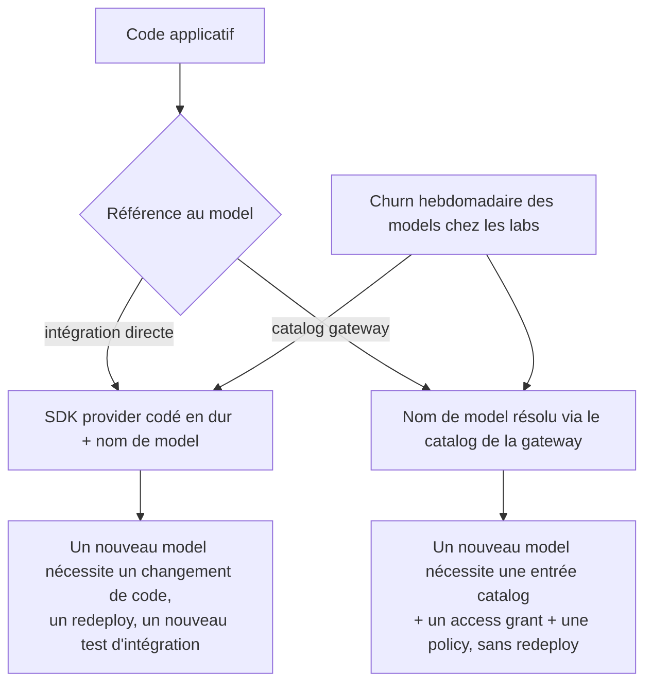

---
{
  "slug": "the-great-model-churn-of-2026-why-model-agnostic-routing-matters",
  "category": "AI Gateway",
  "title": "The Great Model Churn of 2026: Why Model-Agnostic Routing Stopped Being Optional",
  "seoTitle": "AI Model Churn 2026: Why You Need Model-Agnostic Routing",
  "description": "New frontier and open-weight models are shipping roughly every three days in 2026, pricing keeps resetting, and the mid-tier is collapsing. Here is what the release velocity data shows, why hardcoding a model name is now a liability, and how a model-agnostic gateway catalog absorbs the churn.",
  "excerpt": "329+ tracked model releases and counting, a new one roughly every three days, open-weight models now competitive with frontier ones. The model layer is churning faster than any application should try to track by hand. Here is what that means architecturally.",
  "publishedAt": "2026-07-17",
  "updatedAt": "2026-07-17",
  "readingTime": "10 min",
  "keywords": [
    "ai model landscape 2026",
    "model churn",
    "model-agnostic routing",
    "open weight models",
    "llm release velocity",
    "ai gateway model catalog",
    "multi-provider routing"
  ],
  "heroEyebrow": "AI gateway",
  "intro": "If you tried to keep a mental model of 'the best LLM' current in 2026, you lost that race months ago. Release trackers now count well over 300 tracked model releases across major labs, arriving at a pace of roughly one every three days, and open-weight models have closed enough of the gap with frontier proprietary models that they are now a first-class production choice rather than a fallback. Applications that hardcode a model name into their code are making a bet against a market that resets constantly. Here is what the churn actually looks like and what architecture survives it.",
  "keyTakeaways": [
    "Model release velocity has reached roughly one new tracked model every three days across major labs, with frontier releases like GPT-5.6 and Kimi K3 landing within a week of each other in July 2026 alone.",
    "Open-weight models are no longer the budget option: models like GLM-5.2 lead specific benchmark categories outright, and Apache-licensed models like Gemma 4 now run credibly on laptop-class hardware.",
    "The only architecture that absorbs this pace without a rewrite every quarter is a model-agnostic catalog behind one endpoint, where swapping, comparing, or rolling back a model is a configuration change, not an application redeploy."
  ],
  "faq": [
    {
      "question": "Is this just about keeping up with new releases, or is something structural changing?",
      "answer": "Both. The release cadence itself is the visible symptom, but the structural change is that the gap between frontier proprietary models and open-weight models has narrowed enough that open-weight models now win specific benchmark categories outright. That means the 'safe default' of picking one big proprietary provider and treating everything else as a hedge is no longer obviously correct, which raises the cost of an architecture that cannot easily compare or switch."
    },
    {
      "question": "Doesn't a routing layer just delay the decision of which model to use?",
      "answer": "It reframes the decision rather than delaying it. Instead of choosing a model once at build time and living with that choice until the next rewrite, a routing layer lets you choose per request, per team, or per workload, and change that choice as often as the market does, without touching application code. The decision still gets made, it just gets made in configuration instead of in source code."
    },
    {
      "question": "Does adopting more providers or open-weight models add operational complexity?",
      "answer": "It adds complexity if every provider is a separate integration with its own credentials, retry logic, and pricing reconciliation. It adds very little complexity if all of them sit behind one gateway catalog with a shared access, budget, and observability model, which is the entire argument for centralising provider and model management in the first place."
    }
  ],
  "relatedSlugs": [
    "how-to-ship-new-llm-models-without-breaking-production",
    "how-to-design-multi-provider-llm-routing-and-failover",
    "self-host-llms-with-ollama-and-vllm-and-distribute-them-with-odock",
    "litellm-kong-cloudflare-portkey-vs-odock-ai-gateway-comparison"
  ],
  "cta": {
    "title": "Treat every new model as a config change, not a migration",
    "description": "Odock keeps one model and provider catalog behind a single OpenAI-compatible endpoint, so evaluating, routing to, or rolling back any model, proprietary or open-weight, is a policy change, not an application rewrite.",
    "primaryLabel": "Request a demo",
    "primaryHref": "#waitlist-section",
    "secondaryLabel": "Explore the LLM gateway",
    "secondaryHref": "/llm-gateway/"
  },
  "locales": {
    "fr": {
      "category": "AI Gateway",
      "title": "Le grand churn des models en 2026 : pourquoi le routing model-agnostic n'est plus optionnel",
      "seoTitle": "AI Model Churn 2026 : pourquoi il vous faut du routing model-agnostic",
      "description": "De nouveaux models frontier et open-weight sortent environ tous les trois jours en 2026, les prix se réinitialisent en permanence, et le milieu de gamme s'effondre. Voici ce que montrent les données de release velocity, pourquoi coder en dur le nom d'un model est désormais un risque, et comment un catalog de gateway model-agnostic absorbe ce churn.",
      "excerpt": "329+ model releases recensés, et ça continue, un nouveau environ tous les trois jours, des models open-weight désormais compétitifs face aux frontier models. La couche model change plus vite qu'aucune application ne devrait essayer de la suivre à la main. Voici ce que cela signifie sur le plan architectural.",
      "heroEyebrow": "AI gateway",
      "intro": "Si vous avez essayé de garder en tête un modèle mental du « meilleur LLM » en 2026, vous avez perdu cette course il y a des mois. Les trackers de releases recensent aujourd'hui plus de 300 model releases chez les principaux labs, à un rythme d'environ une tous les trois jours, et les models open-weight ont comblé une partie suffisante de l'écart avec les frontier models propriétaires pour devenir un choix de production de premier rang plutôt qu'un repli. Les applications qui codent en dur un nom de model dans leur code parient contre un marché qui se réinitialise en permanence. Voici à quoi ressemble ce churn dans les faits, et quelle architecture y survit.",
      "keyTakeaways": [
        "La release velocity des models a atteint environ un nouveau model tracké tous les trois jours chez les principaux labs, avec des frontier releases comme GPT-5.6 et Kimi K3 sorties à une semaine d'intervalle, rien qu'en juillet 2026.",
        "Les models open-weight ne sont plus l'option économique : des models comme GLM-5.2 dominent purement et simplement certaines catégories de benchmark, et des models sous licence Apache comme Gemma 4 tournent désormais de façon crédible sur du hardware de type laptop.",
        "La seule architecture qui absorbe ce rythme sans rewrite à chaque trimestre est un catalog model-agnostic derrière un seul endpoint, où changer, comparer ou faire un rollback d'un model est un changement de configuration, pas un redeploy applicatif."
      ],
      "cta": {
        "title": "Traitez chaque nouveau model comme un changement de config, pas comme une migration",
        "description": "Odock maintient un unique catalog de models et de providers derrière un seul endpoint compatible OpenAI, si bien qu'évaluer, router vers, ou faire un rollback de n'importe quel model, propriétaire ou open-weight, est un changement de policy, pas un rewrite applicatif.",
        "primaryLabel": "Demander une démo",
        "secondaryLabel": "Explorer la LLM gateway"
      },
      "readingTime": "10 min",
      "keywords": [
        "paysage des models ia 2026",
        "churn des models",
        "routing model-agnostic",
        "models open-weight",
        "vélocité des releases llm",
        "catalog de models ai gateway",
        "routing multi-provider"
      ],
      "faq": [
        {
          "question": "S'agit-il simplement de suivre le rythme des nouvelles releases, ou quelque chose de structurel est-il en train de changer ?",
          "answer": "Les deux. La cadence des releases est le symptôme visible, mais le changement structurel est que l'écart entre les frontier models propriétaires et les models open-weight s'est réduit au point que les models open-weight remportent désormais purement et simplement certaines catégories de benchmark. Cela signifie que le « choix par défaut sûr » consistant à choisir un grand provider propriétaire et à traiter tout le reste comme une couverture n'est plus évidemment le bon, ce qui augmente le coût d'une architecture incapable de comparer ou de switcher facilement."
        },
        {
          "question": "Une couche de routing ne fait-elle pas que reporter la décision du model à utiliser ?",
          "answer": "Elle reformule la décision plutôt que de la reporter. Au lieu de choisir un model une fois au build time et de vivre avec ce choix jusqu'au prochain rewrite, une couche de routing vous permet de choisir par requête, par équipe ou par workload, et de changer ce choix aussi souvent que le marché le fait, sans toucher au code applicatif. La décision est toujours prise, elle l'est simplement en configuration plutôt que dans le code source."
        },
        {
          "question": "Adopter davantage de providers ou de models open-weight ajoute-t-il de la complexité opérationnelle ?",
          "answer": "Cela ajoute de la complexité si chaque provider est une intégration séparée avec ses propres credentials, sa propre logique de retry et sa propre réconciliation des prix. Cela en ajoute très peu si tous se trouvent derrière un même catalog de gateway avec un modèle partagé d'accès, de budget et d'observability, ce qui est précisément l'argument en faveur de la centralisation de la gestion des providers et des models."
        }
      ]
    }
  }
}
---
<!-- locale:en -->
## A new model roughly every three days

By mid-2026, model release trackers list well over 329 distinct releases across major labs and open-weight projects, arriving at a pace of roughly one new model every three days. That is not a steady drip, it is a firehose, and the middle of July 2026 alone illustrates the point: Moonshot AI shipped Kimi K3, a 2.8-trillion-parameter open mixture-of-experts model built on Kimi Delta Attention, on July 16, and OpenAI shipped the GPT-5.6 family, including the Luna, Sol, and Terra variants, a week earlier on July 9. Two frontier-class releases from two different labs, eight days apart, is a normal week now, not an exceptional one.

Reasoning models continue trading raw speed for accuracy as a mainstream option rather than a niche one, multimodal capability is now assumed rather than a differentiator, and the efficiency curve keeps bending: labs are delivering roughly GPT-4-class performance at a fraction of the earlier cost. Pricing itself keeps resetting under this pressure. DeepSeek, for instance, converted what had been a temporary 75% promotional discount into its permanent standard rate in 2026, landing around $0.435 per million input tokens and $0.87 per million output tokens. If your cost model was built around list prices from a year ago, it is already wrong.

## Open-weight models stopped being the fallback option

The more structurally interesting shift is not the release count, it is what open-weight models can now do. Z.ai's GLM-5.2 leads specific categories like SWE-bench Pro outright, not "competes credibly," leads. Google's Gemma 4 12B brought encoder-free multimodal capability to laptop-class hardware under an Apache 2.0 license, meaning a genuinely capable multimodal model can now run on a 16GB machine with no licensing friction at all. Hugging Face's Inference Providers network, covered in our [Hugging Face provider documentation](https://docs.odock.ai/docs/models-and-mcp/providers/huggingface/), now fronts hundreds of these open-weight models across a dozen upstream inference providers behind a single token.

This matters because it breaks the old default reasoning of "pick the best frontier proprietary model and treat everything else as a fallback for cost reasons." In 2026 the fallback option sometimes wins the benchmark that matters for your specific workload, and it can run on hardware you control. That is a genuinely different decision than the one teams were making eighteen months earlier, and an architecture that cannot easily test that decision is now carrying real opportunity cost, not just theoretical inflexibility.

At the same time, market consolidation is happening at the middle of the stack: mid-tier models with no clear differentiation are getting squeezed out between frontier capability at the top and cheap, capable open-weight options at the bottom. Regulatory friction on frontier releases, including export-control reviews affecting specific model launches in 2026, adds another axis of unpredictability to which models are even available in which markets at a given time.

## Why hardcoding a model name is now a liability, not a shortcut

Every direct integration with a specific provider SDK and a specific model string is a bet that this particular model will remain the right choice for as long as the integration code goes unchanged. Given a three-day release cadence and pricing that resets under competitive pressure, that bet loses more often than it used to, and it loses quietly, as a slowly accumulating gap between what you are paying and what you could be paying, or between the capability you shipped with and the capability now available.

The alternative is treating the model as a resolved reference rather than a hardcoded one. Odock's model catalog lets you [add a model from a provider's catalog](https://docs.odock.ai/docs/models-and-mcp/providers/add-models-from-provider/) or [add one manually](https://docs.odock.ai/docs/models-and-mcp/models/add-model-manually/) when it is not yet listed, mapping a stable client-facing name to whatever upstream model actually serves it. Applications call the stable name. What resolves behind it, which provider, which specific model version, which variant, is a configuration decision your team can revisit weekly without anyone touching application code. Our [guide to shipping new models without breaking production](/blog/how-to-ship-new-llm-models-without-breaking-production/) covers the rollout mechanics in detail; this piece is about why that rollout capability needs to be a standing architectural property given how often the underlying decision now needs revisiting.

Routing takes this one step further. Odock's [unified multi-model endpoint](https://docs.odock.ai/docs/management/routing/native-vs-unified-routing/) can choose among candidate models across providers, of the same type and accessible to the same key, which means a churn event, a new model, a price change, a provider outage, can be absorbed as a routing and [failover](https://docs.odock.ai/docs/management/routing/build-failover-plan/) policy change rather than an incident.

## What this means for the self-hosting question

The rise of genuinely competitive open-weight models is not just an abstract market observation, it is the precondition for a decision more teams are making in 2026: running some models yourself rather than calling every request out to a hosted API. A model like Gemma 4 running on a 16GB machine, or a larger open-weight model served through a production inference engine, is now a credible production option, not a hobbyist curiosity. We cover exactly how to do that, and how to distribute the result to your own users with proper governance, in [our guide to self-hosting with Ollama and vLLM](/blog/self-host-llms-with-ollama-and-vllm-and-distribute-them-with-odock/).

## The honest limits here

A model-agnostic catalog does not make the underlying evaluation work disappear. Someone still has to benchmark a candidate model against your actual workload before routing production traffic to it, a routing layer just means that evaluation's result is cheap to act on. And centralising models behind one catalog concentrates operational importance on that catalog, so its own reliability and change-management discipline matter more, not less, as the number of models behind it grows.

## Where Odock.ai comes in

I built Odock's model and provider layer around the assumption that the market underneath it would never sit still, so factor that bias in. Every model, proprietary or open-weight, self-hosted or provider-hosted, lives behind the same catalog, the same access-grant model, the same budgets, and the same usage records, reachable through one OpenAI-compatible endpoint. Adding this quarter's best open-weight model, or dropping last quarter's now-overpriced one, is a catalog entry and a policy change, not a migration project.

If your team is still re-litigating a model choice in application code every time the market moves, and in 2026 it moves roughly every three days, the fix is not picking harder, it is moving the decision to a layer built to absorb that pace. [Request a demo](#waitlist-section) or start with the [Odock LLM gateway](/llm-gateway/) and stop shipping a code change every time a better model appears.

## Sources

- [AI Updates Today (July 2026), LLM Stats](https://llm-stats.com/llm-updates)
- [The 2026 LLM Landscape: A Strategic Guide, Aunimeda](https://aunimeda.com/blog/llm-landscape-2026-guide-for-ctos)
- [LLM Landscape 2026: Intelligence Leaderboard and Model Guide, RobotMunki](https://www.robotmunki.com/blog/llm-landscape)
- [Odock Hugging Face provider](https://docs.odock.ai/docs/models-and-mcp/providers/huggingface/)
- [Odock native vs unified routing](https://docs.odock.ai/docs/management/routing/native-vs-unified-routing/)

<!-- locale:fr -->
## Un nouveau model environ tous les trois jours

Mi-2026, les trackers de releases recensent plus de 329 releases distinctes chez les principaux labs et projets open-weight, à un rythme d'environ un nouveau model tous les trois jours. Ce n'est pas un goutte-à-goutte régulier, c'est un torrent, et la mi-juillet 2026 à elle seule illustre bien le propos : Moonshot AI a sorti Kimi K3, un model mixture-of-experts open de 2,8 trillions de paramètres construit sur Kimi Delta Attention, le 16 juillet, et OpenAI a sorti la famille GPT-5.6, incluant les variantes Luna, Sol et Terra, une semaine plus tôt, le 9 juillet. Deux releases de niveau frontier venant de deux labs différents, à huit jours d'intervalle, c'est désormais une semaine normale, pas une exception.

Les reasoning models continuent d'échanger de la vitesse brute contre de la précision, et ce en tant qu'option mainstream plutôt que de niche ; la capacité multimodale est désormais un prérequis et non un différenciateur, et la courbe d'efficacité continue de se creuser : les labs livrent des performances proches du niveau GPT-4 pour une fraction du coût d'avant. Les prix eux-mêmes se réinitialisent en permanence sous cette pression. DeepSeek, par exemple, a transformé ce qui était une remise promotionnelle temporaire de 75 % en son tarif standard permanent en 2026, autour de 0,435 $ par million de tokens en entrée et 0,87 $ par million de tokens en sortie. Si votre modèle de coût a été construit autour des prix catalogue d'il y a un an, il est déjà faux.

## Les models open-weight ne sont plus l'option de repli

Le changement le plus intéressant sur le plan structurel n'est pas le nombre de releases, c'est ce que les models open-weight sont désormais capables de faire. GLM-5.2 de Z.ai domine purement et simplement des catégories spécifiques comme SWE-bench Pro — pas « rivalise de façon crédible », domine. Gemma 4 12B de Google a apporté une capacité multimodale encoder-free à du hardware de type laptop sous licence Apache 2.0, ce qui signifie qu'un model multimodal réellement performant peut désormais tourner sur une machine de 16 Go sans aucune friction de licence. Le réseau Inference Providers de Hugging Face, que nous couvrons dans notre [documentation sur le provider Hugging Face](https://docs.odock.ai/docs/models-and-mcp/providers/huggingface/), expose désormais des centaines de ces models open-weight répartis sur une douzaine d'inference providers en amont, derrière un seul token.

C'est important, car cela brise l'ancien raisonnement par défaut qui consistait à « choisir le meilleur frontier model propriétaire et traiter tout le reste comme un repli pour des raisons de coût. » En 2026, l'option de repli remporte parfois le benchmark qui compte réellement pour votre workload spécifique, et elle peut tourner sur du hardware que vous contrôlez. C'est une décision réellement différente de celle que prenaient les équipes dix-huit mois plus tôt, et une architecture incapable de tester facilement cette décision porte désormais un vrai coût d'opportunité, pas seulement une rigidité théorique.

Dans le même temps, une consolidation du marché s'opère au milieu de la stack : les models mid-tier sans différenciation claire se retrouvent pris en étau entre la capacité frontier en haut et les options open-weight bon marché et performantes en bas. La friction réglementaire sur les frontier releases, y compris les revues de contrôle des exportations affectant certains lancements de models en 2026, ajoute un axe d'imprévisibilité supplémentaire quant aux models réellement disponibles, sur quels marchés, à un instant donné.

## Pourquoi coder en dur un nom de model est désormais un risque, pas un raccourci

Chaque intégration directe avec un SDK provider spécifique et une chaîne de model spécifique est un pari : que ce model précis restera le bon choix aussi longtemps que le code d'intégration ne change pas. Avec une cadence de release de trois jours et des prix qui se réinitialisent sous la pression concurrentielle, ce pari perd plus souvent qu'avant, et il perd silencieusement, sous la forme d'un écart qui s'accumule lentement entre ce que vous payez et ce que vous pourriez payer, ou entre la capacité que vous avez livrée et celle désormais disponible.

L'alternative consiste à traiter le model comme une référence résolue plutôt que codée en dur. Le catalog de models d'Odock vous permet d'[ajouter un model depuis le catalog d'un provider](https://docs.odock.ai/docs/models-and-mcp/providers/add-models-from-provider/) ou d'[en ajouter un manuellement](https://docs.odock.ai/docs/models-and-mcp/models/add-model-manually/) lorsqu'il n'est pas encore listé, en associant un nom stable côté client au model upstream qui le sert réellement. Les applications appellent le nom stable. Ce qui se résout derrière — quel provider, quelle version précise du model, quelle variante — est une décision de configuration que votre équipe peut revoir chaque semaine sans que personne ne touche au code applicatif. Notre [guide sur le déploiement de nouveaux models sans casser la production](/fr/blog/how-to-ship-new-llm-models-without-breaking-production/) détaille la mécanique du rollout ; cet article explique pourquoi cette capacité de rollout doit être une propriété architecturale permanente, étant donné la fréquence à laquelle cette décision sous-jacente doit désormais être révisée.

Le routing va encore plus loin. L'[endpoint multi-model unifié](https://docs.odock.ai/docs/management/routing/native-vs-unified-routing/) d'Odock peut choisir parmi des models candidats à travers plusieurs providers, de même type et accessibles avec la même clé, ce qui signifie qu'un événement de churn, un nouveau model, un changement de prix, une panne de provider, peut être absorbé comme un changement de policy de routing et de [failover](https://docs.odock.ai/docs/management/routing/build-failover-plan/) plutôt que comme un incident.

## Ce que cela signifie pour la question du self-hosting

La montée en puissance de models open-weight réellement compétitifs n'est pas qu'une observation abstraite sur le marché, c'est la condition préalable à une décision que de plus en plus d'équipes prennent en 2026 : faire tourner certains models soi-même plutôt que d'envoyer chaque requête vers une API hébergée. Un model comme Gemma 4 tournant sur une machine de 16 Go, ou un model open-weight plus volumineux servi via un moteur d'inférence de production, est désormais une option de production crédible, et non une curiosité de hobbyiste. Nous expliquons précisément comment procéder, et comment distribuer le résultat à vos propres utilisateurs avec une gouvernance adéquate, dans notre [guide sur le self-hosting avec Ollama et vLLM](/fr/blog/self-host-llms-with-ollama-and-vllm-and-distribute-them-with-odock/).

## Les limites à connaître

Un catalog model-agnostic ne fait pas disparaître le travail d'évaluation sous-jacent. Quelqu'un doit toujours benchmarker un model candidat sur votre workload réel avant de lui router du trafic de production ; une couche de routing signifie simplement que le résultat de cette évaluation coûte peu cher à mettre en œuvre. Et centraliser les models derrière un seul catalog concentre l'importance opérationnelle sur ce catalog : sa propre fiabilité et sa discipline de change-management comptent donc davantage, pas moins, à mesure que le nombre de models qu'il héberge augmente.

## Là où Odock.ai intervient

J'ai conçu la couche models et providers d'Odock en partant du principe que le marché sous-jacent ne resterait jamais stable ; tenez-en compte dans ce qui suit, ce n'est pas un point de vue neutre. Chaque model, propriétaire ou open-weight, self-hosted ou hébergé par un provider, vit derrière le même catalog, le même access-grant model, les mêmes budgets et les mêmes usage records, accessible via un seul endpoint compatible OpenAI. Ajouter le meilleur model open-weight du trimestre, ou abandonner celui du trimestre précédent devenu trop cher, est une entrée dans le catalog et un changement de policy, pas un projet de migration.

Si votre équipe rediscute encore un choix de model dans le code applicatif à chaque mouvement du marché — et en 2026, il bouge environ tous les trois jours —, la solution n'est pas de mieux choisir, mais de déplacer cette décision vers une couche conçue pour absorber ce rythme. [Demandez une démo](#waitlist-section) ou démarrez avec la [LLM gateway Odock](/fr/llm-gateway/) et arrêtez de livrer un changement de code à chaque fois qu'un meilleur model apparaît.

## Sources

- [AI Updates Today (July 2026), LLM Stats](https://llm-stats.com/llm-updates)
- [The 2026 LLM Landscape: A Strategic Guide, Aunimeda](https://aunimeda.com/blog/llm-landscape-2026-guide-for-ctos)
- [LLM Landscape 2026: Intelligence Leaderboard and Model Guide, RobotMunki](https://www.robotmunki.com/blog/llm-landscape)
- [Provider Hugging Face Odock](https://docs.odock.ai/docs/models-and-mcp/providers/huggingface/)
- [Routing natif vs unifié Odock](https://docs.odock.ai/docs/management/routing/native-vs-unified-routing/)
