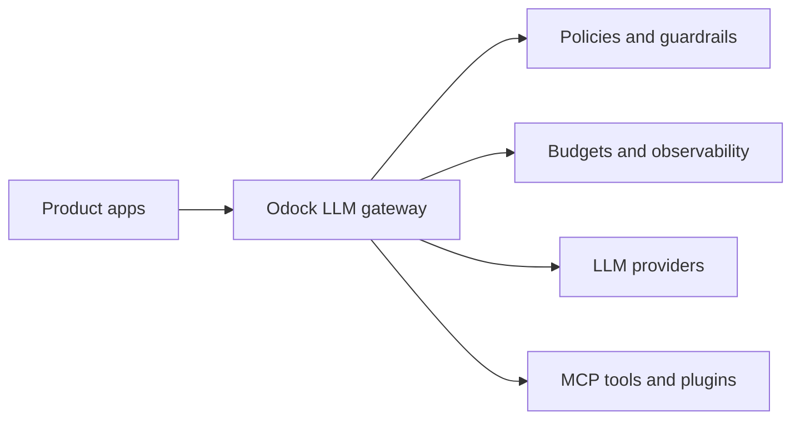
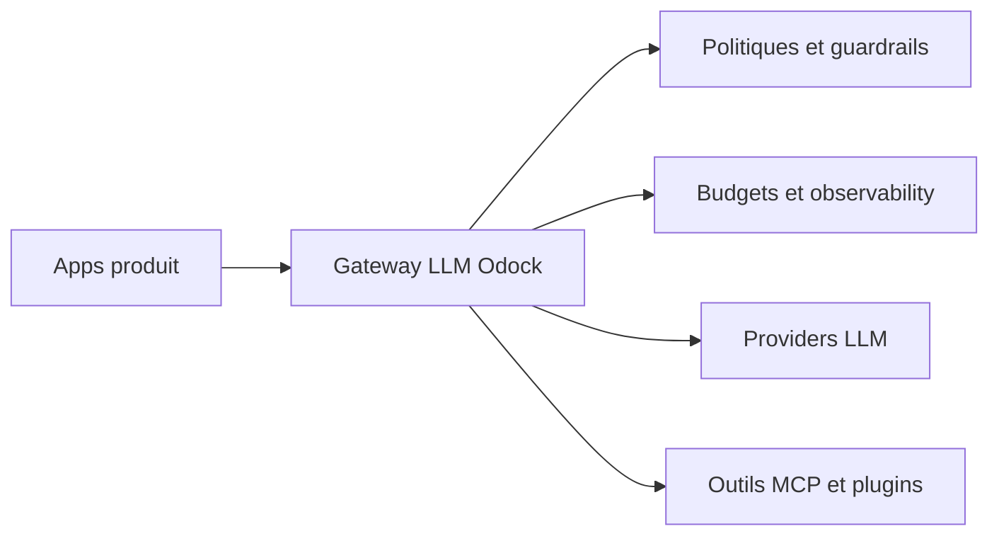
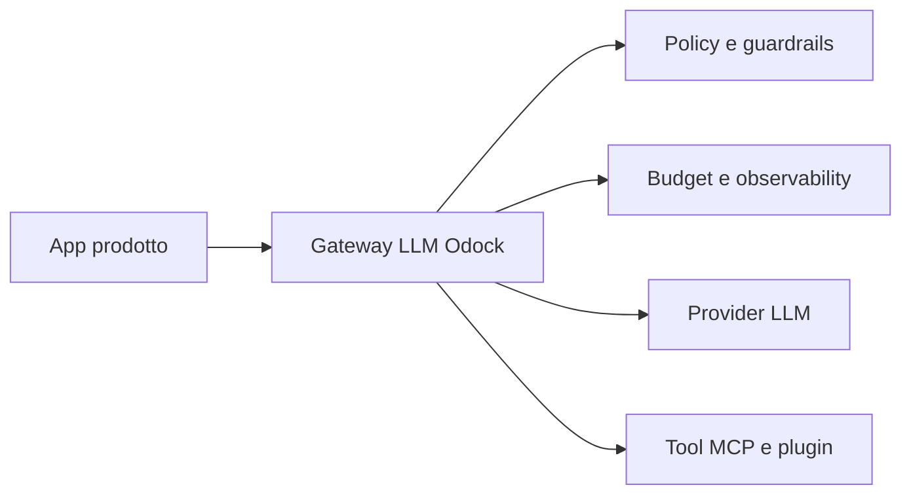

---
{
  "slug": "what-is-an-llm-gateway-and-why-ai-teams-need-one",
  "category": "LLM Infrastructure",
  "title": "What Is an LLM Gateway and Why AI Teams Need One Before Production",
  "seoTitle": "What Is an LLM Gateway? AI Production Guide",
  "description": "Learn what an LLM gateway is, why AI teams adopt one before scale, and how Odock helps control providers, security, spend, and reliability from a single endpoint.",
  "excerpt": "As soon as AI moves beyond a prototype, teams hit provider sprawl, fragile routing, weak governance, and runaway cost. This article explains the job an LLM gateway actually does and why Odock exists.",
  "publishedAt": "2026-04-27",
  "updatedAt": "2026-04-27",
  "readingTime": "8 min",
  "keywords": [
    "llm gateway",
    "ai gateway",
    "multi-provider llm infrastructure",
    "llm routing",
    "odock",
    "mcp gateway"
  ],
  "heroEyebrow": "Odock mission",
  "intro": "Most AI teams start simple: one model provider, one API key, one product feature. The trouble starts when that prototype begins to matter. A second team needs access, finance wants cost visibility, security asks how prompts are filtered, and uptime suddenly depends on a single vendor. That is the moment an LLM gateway stops being optional infrastructure and becomes the control layer your stack is missing.",
  "keyTakeaways": [
    "An LLM gateway standardizes access to multiple providers behind a single API contract.",
    "The right gateway is not only a router. It must also enforce security, budgets, permissions, and observability.",
    "Odock is built to give AI teams one controlled entry point for providers, MCP tools, plugins, and governance."
  ],
  "faq": [
    {
      "question": "Is an LLM gateway only useful if I use multiple providers?",
      "answer": "No. Multi-provider routing is a common reason to adopt one, but teams also need gateways for spend control, security guardrails, auditability, virtual API keys, and stable application integration patterns."
    },
    {
      "question": "How is Odock different from a generic API gateway?",
      "answer": "Odock is built specifically for AI traffic. It focuses on model routing, provider normalization, prompt security, budgets, quotas, plugin workflows, MCP tool access, and AI-specific observability rather than generic HTTP proxying alone."
    },
    {
      "question": "Does adopting Odock require rewriting my existing app?",
      "answer": "No. Odock is designed as a drop-in control layer. The goal is to keep your application code stable while the gateway handles provider access, policy enforcement, and operational controls behind one endpoint."
    }
  ],
  "relatedSlugs": [
    "prompt-injection-data-leakage-and-llm-security-guardrails",
    "how-to-control-llm-costs-with-virtual-api-keys-budgets-and-quotas",
    "shadow-ai-2026-how-to-govern-unsanctioned-ai-tool-use"
  ],
  "cta": {
    "title": "Need a production-ready control plane for AI traffic?",
    "description": "Odock helps teams standardize provider access, secure prompts, control spend, and keep AI integrations flexible as the stack evolves.",
    "primaryLabel": "Request a demo",
    "primaryHref": "#waitlist-section",
    "secondaryLabel": "Explore the GitHub",
    "secondaryHref": "https://github.com/odock-ai"
  },
  "locales": {
    "fr": {
      "category": "Infrastructure LLM",
      "title": "Qu’est-ce qu’un LLM gateway et pourquoi les équipes IA en ont besoin avant la production",
      "seoTitle": "Qu’est-ce qu’un LLM gateway ? Guide de production IA",
      "description": "Découvrez ce qu’est un LLM gateway, pourquoi les équipes IA l’adoptent avant de passer à l’échelle, et comment Odock aide à contrôler les providers, la sécurité, les dépenses et la fiabilité depuis un seul endpoint.",
      "excerpt": "Dès que l’AI dépasse le prototype, les équipes font face à la dispersion des providers, à un routing fragile, à une gouvernance faible et à des coûts incontrôlés. Cet article explique le rôle concret d’un LLM gateway et pourquoi Odock existe.",
      "heroEyebrow": "Mission Odock",
      "intro": "La plupart des équipes IA commencent simplement : un provider de model, une clé API, une fonctionnalité produit. Les problèmes commencent quand ce prototype devient important. Une deuxième équipe a besoin d’un accès, la finance veut de la visibilité sur les coûts, la sécurité demande comment les prompts sont filtrés, et l’uptime dépend soudain d’un seul vendor. C’est à ce moment qu’un LLM gateway cesse d’être une infrastructure optionnelle et devient la couche de contrôle qui manque à votre stack.",
      "keyTakeaways": [
        "Un LLM gateway standardise l’accès à plusieurs providers derrière un contrat API unique.",
        "Le bon gateway n’est pas seulement un router. Il doit aussi appliquer la sécurité, les budgets, les permissions et l’observability.",
        "Odock est conçu pour donner aux équipes IA un point d’entrée contrôlé pour les providers, les outils MCP, les plugins et la gouvernance."
      ],
      "cta": {
        "title": "Besoin d’un control plane prêt pour la production pour votre trafic IA ?",
        "description": "Odock aide les équipes à standardiser l’accès aux providers, sécuriser les prompts, contrôler les dépenses et garder des intégrations IA flexibles à mesure que la stack évolue.",
        "primaryLabel": "Demander une démo",
        "secondaryLabel": "Explorer le GitHub"
      },
      "readingTime": "8 min",
      "keywords": [
        "llm gateway",
        "ai gateway",
        "multi-provider llm infrastructure",
        "llm routing",
        "odock",
        "mcp gateway"
      ],
      "faq": [
        {
          "question": "Un LLM gateway est-il utile seulement si j’utilise plusieurs providers ?",
          "answer": "Non. Le routing multi-provider est une raison fréquente d’en adopter un, mais les équipes ont aussi besoin de gateways pour contrôler les dépenses, appliquer des guardrails de sécurité, assurer l’auditabilité, gérer des virtual API keys et stabiliser les patterns d’intégration applicative."
        },
        {
          "question": "En quoi Odock diffère-t-il d’un API gateway générique ?",
          "answer": "Odock est conçu spécifiquement pour le trafic IA. Il se concentre sur le routing de models, la normalisation des providers, la sécurité des prompts, les budgets, les quotas, les workflows de plugins, l’accès aux outils MCP et l’observability propre à l’AI, plutôt que sur le simple proxying HTTP générique."
        },
        {
          "question": "Adopter Odock oblige-t-il à réécrire mon application ?",
          "answer": "Non. Odock est conçu comme une couche de contrôle drop-in. L’objectif est de garder votre code applicatif stable pendant que le gateway gère l’accès aux providers, l’application des politiques et les contrôles opérationnels derrière un endpoint unique."
        }
      ]
    },
    "it": {
      "category": "Infrastruttura LLM",
      "title": "Che cos’è un LLM gateway e perché i team AI ne hanno bisogno prima della produzione",
      "seoTitle": "Che cos’è un LLM gateway? Guida alla produzione AI",
      "description": "Scopri che cos’è un LLM gateway, perché i team AI lo adottano prima di scalare e come Odock aiuta a controllare provider, sicurezza, spesa e affidabilità da un unico endpoint.",
      "excerpt": "Appena l’AI supera il prototipo, i team incontrano proliferazione dei provider, routing fragile, governance debole e costi fuori controllo. Questo articolo spiega cosa fa davvero un LLM gateway e perché esiste Odock.",
      "heroEyebrow": "Missione Odock",
      "intro": "La maggior parte dei team AI parte in modo semplice: un model provider, una chiave API, una funzionalità di prodotto. I problemi iniziano quando quel prototipo comincia a contare. Un secondo team ha bisogno di accesso, la finanza vuole visibilità sui costi, la sicurezza chiede come vengono filtrati i prompt e l’uptime dipende all’improvviso da un solo vendor. È il momento in cui un LLM gateway smette di essere infrastruttura opzionale e diventa il livello di controllo che manca allo stack.",
      "keyTakeaways": [
        "Un gateway LLM standardizza l’accesso a più provider dietro un unico contratto API.",
        "Il gateway giusto non è solo un router. Deve anche applicare sicurezza, budget, permessi e observability.",
        "Odock è costruito per dare ai team AI un unico punto di ingresso controllato per provider, tool MCP, plugin e governance."
      ],
      "cta": {
        "title": "Ti serve un control plane pronto per la produzione del traffico AI?",
        "description": "Odock aiuta i team a standardizzare l’accesso ai provider, proteggere i prompt, controllare la spesa e mantenere flessibili le integrazioni AI mentre lo stack evolve.",
        "primaryLabel": "Richiedi una demo",
        "secondaryLabel": "Esplora GitHub"
      },
      "readingTime": "8 min",
      "keywords": [
        "llm gateway",
        "ai gateway",
        "multi-provider llm infrastructure",
        "llm routing",
        "odock",
        "mcp gateway"
      ],
      "faq": [
        {
          "question": "Un gateway LLM è utile solo se uso più provider?",
          "answer": "No. Il routing multi-provider è un motivo comune per adottarne uno, ma i team hanno bisogno di gateway anche per controllo della spesa, guardrails di sicurezza, auditability, virtual API keys e pattern di integrazione applicativa stabili."
        },
        {
          "question": "In cosa Odock è diverso da un API gateway generico?",
          "answer": "Odock è costruito specificamente per il traffico AI. Si concentra su routing dei model, normalizzazione dei provider, sicurezza dei prompt, budget, quotas, workflow di plugin, accesso ai tool MCP e observability specifica per l’AI, invece del solo proxying HTTP generico."
        },
        {
          "question": "Adottare Odock richiede di riscrivere l’applicazione?",
          "answer": "No. Odock è progettato come livello di controllo drop-in. L’obiettivo è mantenere stabile il codice applicativo mentre il gateway gestisce accesso ai provider, applicazione delle policy e controlli operativi dietro un solo endpoint."
        }
      ]
    }
  }
}
---
<!-- locale:en -->
## What an LLM gateway actually does

An LLM gateway sits between your applications and the models or tools they call. Instead of hardwiring every product surface to a specific vendor SDK, your applications send traffic to one stable endpoint. The gateway translates requests, routes them to the right destination, and returns responses in a consistent format.

That sounds simple, but the real value is operational. A good gateway becomes the place where you centralize policies, model permissions, request inspection, observability, quotas, and failover. Without that layer, each application team ends up rebuilding a partial version of governance on its own.

- Standardize provider access behind one endpoint
- Switch or combine models without rewriting application code
- Expose MCP tools and model providers through a single control plane
- Collect consistent logs, metrics, and traces for every request

## Common pain points that appear after the prototype phase

Early AI integrations are often optimized for speed rather than control. A developer can ship fast by embedding one provider key directly into an app service and calling the first model that works. The downside is that every shortcut becomes technical debt when traffic, teams, and risk increase.

Once more than one product team depends on AI, fragmentation becomes expensive. Different services use different SDKs. Billing is spread across accounts. Nobody can answer which team spent what, which prompts were blocked, or which provider is failing the most often. This is a classic infrastructure problem, not an isolated prompt engineering problem.

- Each provider has different APIs, rate limits, auth models, and operational quirks.
- Teams share master credentials because there is no safe way to issue isolated access per project or user.
- Prompt injection, jailbreak attempts, and sensitive data leakage are handled inconsistently or not at all.
- Cost spikes go unnoticed until the monthly bill arrives because budgets and quotas are not enforced at the gateway.
- Failover between providers is manual, slow, and usually incomplete when latency or outages hit production.

## The goal behind Odock

Odock exists to give teams one dock for every LLM provider and MCP server they need to operate. The goal is not only to aggregate vendors. The goal is to make AI infrastructure manageable in production: secure by default, observable, cost-aware, and flexible enough to evolve as your model stack changes.

That is why Odock combines a unified multimodel interface with virtual API keys, policy controls, guardrails, budgets, quotas, plugin workflows, batching, and adaptive failover. It is designed for teams that do not want their core application code to become the place where governance and reliability are improvised.

- Reduce provider lock-in by keeping your app code vendor-agnostic
- Issue isolated access for teams, users, and projects through virtual API keys
- Apply prompt security and data leakage rules directly in the request pipeline
- Track and enforce spend before bills become surprises
- Keep uptime stable with routing and failover across providers

## Signals that your team needs Odock now

You do not need a unified gateway on day one. You need it when the cost of not having one is already visible. In practice, that threshold arrives earlier than many teams expect.

If your roadmap includes multiple models, external tool use, customer-specific usage controls, regulated data, or enterprise sales conversations, you are already in the zone where centralized AI governance matters. Building that layer late is always harder because the application surface has already scattered assumptions across several services.

- You use or plan to use more than one LLM provider
- You need team-level or customer-level quotas and permissions
- You are exposing AI features to paying users and need auditability
- You cannot tolerate downtime from a single provider outage
- You need a clean way to connect MCP tools, plugins, and custom workflows

## Why a single endpoint matters for velocity

Teams often think governance slows shipping down. In reality, the lack of a gateway slows shipping down more. Every time a team adds a new model, negotiates new credentials, or patches provider-specific behavior in an app service, the platform becomes harder to maintain.

A unified endpoint changes that. Product teams integrate once. Platform teams control policies centrally. Finance gets visibility. Security gets one enforcement layer. Reliability work moves into infrastructure where it belongs. That is the leverage Odock is designed to provide.

<!-- locale:fr -->
## Ce que fait réellement un LLM gateway

Un LLM gateway se place entre vos applications et les models ou tools qu’elles appellent. Au lieu de câbler chaque surface produit à un SDK vendor spécifique, vos applications envoient le trafic vers un endpoint stable. Le gateway traduit les requêtes, les route vers la bonne destination et renvoie les réponses dans un format cohérent.

Cela paraît simple, mais la vraie valeur est opérationnelle. Un bon gateway devient l’endroit où vous centralisez les politiques, les permissions de models, l’inspection des requêtes, l’observability, les quotas et le failover. Sans cette couche, chaque équipe applicative finit par reconstruire sa propre version partielle de la gouvernance.

- Standardiser l’accès aux providers derrière un endpoint unique
- Changer ou combiner des models sans réécrire le code applicatif
- Exposer les outils MCP et les model providers à travers un seul control plane
- Collecter des logs, métriques et traces cohérents pour chaque requête

## Les points de friction qui apparaissent après la phase de prototype

Les premières intégrations IA sont souvent optimisées pour la vitesse plutôt que pour le contrôle. Un développeur peut livrer rapidement en intégrant une clé provider directement dans un service applicatif et en appelant le premier model qui fonctionne. L’inconvénient, c’est que chaque raccourci devient de la dette technique quand le trafic, les équipes et les risques augmentent.

Dès que plus d’une équipe produit dépend de l’AI, la fragmentation devient coûteuse. Différents services utilisent différents SDK. La facturation est répartie entre plusieurs comptes. Personne ne peut dire quelle équipe a dépensé quoi, quels prompts ont été bloqués, ou quel provider échoue le plus souvent. C’est un problème d’infrastructure classique, pas un problème isolé de prompt engineering.

- Chaque provider a des APIs, des rate limits, des modèles d’authentification et des particularités opérationnelles différents.
- Les équipes partagent des credentials maîtres parce qu’il n’existe pas de moyen sûr d’émettre des accès isolés par projet ou par utilisateur.
- La prompt injection, les tentatives de jailbreak et les fuites de données sensibles sont traitées de manière incohérente, voire pas du tout.
- Les pics de coûts passent inaperçus jusqu’à l’arrivée de la facture mensuelle parce que les budgets et quotas ne sont pas appliqués au niveau du gateway.
- Le failover entre providers est manuel, lent et généralement incomplet quand la latency ou les pannes touchent la production.

## Le but d’Odock

Odock existe pour donner aux équipes un dock unique pour chaque LLM provider et chaque serveur MCP dont elles ont besoin pour opérer. L’objectif n’est pas seulement d’agréger des vendors. L’objectif est de rendre l’infrastructure IA maîtrisable en production : sécurisée par défaut, observable, sensible aux coûts et assez flexible pour évoluer avec votre stack de models.

C’est pourquoi Odock combine une interface multimodel unifiée avec des virtual API keys, des contrôles de politiques, des guardrails, des budgets, des quotas, des workflows de plugins, du batching et un failover adaptatif. Il est conçu pour les équipes qui ne veulent pas que leur code applicatif central devienne l’endroit où la gouvernance et la fiabilité sont improvisées.

- Réduire le lock-in provider en gardant votre code applicatif vendor-agnostic
- Émettre des accès isolés pour les équipes, les utilisateurs et les projets via des virtual API keys
- Appliquer les règles de sécurité des prompts et de fuite de données directement dans le pipeline de requêtes
- Suivre et appliquer les limites de dépenses avant que les factures ne deviennent des surprises
- Maintenir un uptime stable avec du routing et du failover entre providers

## Les signaux que votre équipe a besoin d’Odock maintenant

Vous n’avez pas besoin d’un gateway unifié le premier jour. Vous en avez besoin quand le coût de son absence est déjà visible. En pratique, ce seuil arrive plus tôt que beaucoup d’équipes ne l’imaginent.

Si votre roadmap inclut plusieurs models, l’utilisation d’outils externes, des contrôles d’usage par client, des données réglementées ou des discussions commerciales enterprise, vous êtes déjà dans la zone où une gouvernance IA centralisée compte. Construire cette couche tard est toujours plus difficile, parce que la surface applicative a déjà dispersé ses hypothèses dans plusieurs services.

- Vous utilisez ou prévoyez d’utiliser plus d’un LLM provider
- Vous avez besoin de quotas et de permissions au niveau équipe ou client
- Vous exposez des fonctionnalités IA à des utilisateurs payants et avez besoin d’auditabilité
- Vous ne pouvez pas tolérer une interruption causée par la panne d’un seul provider
- Vous avez besoin d’un moyen propre de connecter des outils MCP, des plugins et des workflows personnalisés

## Pourquoi un endpoint unique accélère

Les équipes pensent souvent que la gouvernance ralentit les livraisons. En réalité, l’absence de gateway ralentit davantage. Chaque fois qu’une équipe ajoute un nouveau model, négocie de nouveaux credentials ou corrige un comportement propre à un provider dans un service applicatif, la plateforme devient plus difficile à maintenir.

Un endpoint unifié change cela. Les équipes produit intègrent une seule fois. Les équipes plateforme contrôlent les politiques de manière centralisée. La finance obtient de la visibilité. La sécurité dispose d’une couche d’application unique. Le travail de fiabilité passe dans l’infrastructure, là où il doit se trouver. C’est le levier qu’Odock est conçu pour apporter.

<!-- locale:it -->
## Cosa fa davvero un gateway LLM

Un LLM gateway si posiziona tra le applicazioni e i model o tool che chiamano. Invece di collegare ogni superficie di prodotto a uno specifico vendor SDK, le applicazioni inviano il traffico a un endpoint stabile. Il gateway traduce le richieste, le instrada verso la destinazione corretta e restituisce risposte in un formato coerente.

Sembra semplice, ma il vero valore è operativo. Un buon gateway diventa il punto in cui centralizzare policy, permessi sui model, ispezione delle richieste, observability, quotas e failover. Senza questo livello, ogni team applicativo finisce per ricostruire da solo una versione parziale della governance.

- Standardizzare l’accesso ai provider dietro un endpoint unico
- Cambiare o combinare model senza riscrivere il codice applicativo
- Esporre tool MCP e model provider attraverso un unico control plane
- Raccogliere log, metriche e tracce coerenti per ogni richiesta

## I problemi comuni che emergono dopo la fase di prototipo

Le prime integrazioni AI sono spesso ottimizzate per la velocità più che per il controllo. Uno sviluppatore può rilasciare rapidamente inserendo una chiave provider direttamente in un servizio applicativo e chiamando il primo model che funziona. Il rovescio della medaglia è che ogni scorciatoia diventa debito tecnico quando aumentano traffico, team e rischi.

Quando più di un team di prodotto dipende dall’AI, la frammentazione diventa costosa. Servizi diversi usano SDK diversi. La fatturazione è distribuita su più account. Nessuno sa rispondere a quale team ha speso quanto, quali prompt sono stati bloccati o quale provider fallisce più spesso. È un classico problema di infrastruttura, non un problema isolato di prompt engineering.

- Ogni provider ha API, rate limits, modelli di autenticazione e peculiarità operative diverse.
- I team condividono credenziali master perché non esiste un modo sicuro per emettere accessi isolati per progetto o utente.
- Prompt injection, tentativi di jailbreak e leakage di dati sensibili sono gestiti in modo incoerente o non vengono gestiti affatto.
- I picchi di costo passano inosservati fino all’arrivo della fattura mensile perché budget e quotas non sono applicati al gateway.
- Il failover tra provider è manuale, lento e di solito incompleto quando latency o outage arrivano in produzione.

## L’obiettivo di Odock

Odock esiste per dare ai team un unico dock per ogni provider LLM e server MCP di cui hanno bisogno per operare. L’obiettivo non è solo aggregare vendor. L’obiettivo è rendere l’infrastruttura AI gestibile in produzione: sicura di default, observable, consapevole dei costi e abbastanza flessibile da evolvere quando cambia lo stack di model.

Per questo Odock combina un’interfaccia multimodel unificata con virtual API keys, controlli di policy, guardrails, budget, quotas, workflow di plugin, batching e failover adattivo. È progettato per team che non vogliono trasformare il codice applicativo core nel luogo in cui governance e affidabilità vengono improvvisate.

- Ridurre il provider lock-in mantenendo il codice applicativo vendor-agnostic
- Emettere accessi isolati per team, utenti e progetti tramite virtual API keys
- Applicare regole di sicurezza dei prompt e di data leakage direttamente nella request pipeline
- Tracciare e applicare la spesa prima che le fatture diventino sorprese
- Mantenere stabile l’uptime con routing e failover tra provider

## I segnali che il team ha bisogno di Odock adesso

Non serve un gateway unificato il primo giorno. Serve quando il costo di non averlo è già visibile. In pratica, quella soglia arriva prima di quanto molti team si aspettino.

Se la roadmap include più model, uso di tool esterni, controlli di utilizzo specifici per cliente, dati regolamentati o conversazioni commerciali enterprise, siete già nella zona in cui la governance AI centralizzata conta. Costruire questo livello in ritardo è sempre più difficile, perché la superficie applicativa ha già disperso assunzioni in diversi servizi.

- Usi o prevedi di usare più di un provider LLM
- Ti servono quotas e permessi a livello di team o cliente
- Stai esponendo funzionalità AI a utenti paganti e ti serve auditability
- Non puoi tollerare downtime dovuto all’outage di un singolo provider
- Ti serve un modo pulito per collegare tool MCP, plugin e workflow personalizzati

## Perché un endpoint unico accelera

I team spesso pensano che la governance rallenti le release. In realtà, l’assenza di un gateway rallenta di più. Ogni volta che un team aggiunge un nuovo model, negozia nuove credenziali o corregge in un servizio applicativo un comportamento specifico di un provider, la piattaforma diventa più difficile da mantenere.

Un endpoint unificato cambia questo. I team di prodotto integrano una sola volta. I team platform controllano le policy centralmente. La finanza ottiene visibilità. La sicurezza ha un unico livello di enforcement. Il lavoro sull’affidabilità si sposta nell’infrastruttura, dove appartiene. È la leva che Odock è progettato per offrire.
